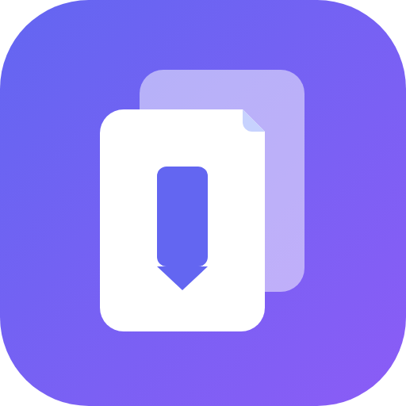

    

# 

Saiye is a self-hostable bookmark-everything app with a touch of AI. Save links, notes, images and PDFs, let AI tag and summarize them for you, and find anything back with full-text and semantic search.

## Features

- Bookmark links, take simple notes and store images and pdfs.
- Automatic fetching for link titles, descriptions and images.
- Sort your bookmarks into lists.
- Collaborate with others on the same list.
- Full text & semantic search of all the content stored.
- LLM-based automatic tagging and summarization. With supports for local models using ollama!
- Rule-based engine for customized management.
- OCR for extracting text from images.
- Browser extensions for Chrome and Firefox for quick bookmarking.
- Mobile apps for iOS and Android, with offline reading.
- Auto-archiving from RSS feeds.
- REST API and multiple clients.
- Multi-language support.
- Mark and store highlights from your saved content.
- Full page archival (using [monolith](https://github.com/Y2Z/monolith)) to protect against link rot.
- Auto video archiving using [yt-dlp](https://github.com/yt-dlp/yt-dlp).
- Bulk actions support.
- SSO support.
- Dark mode support.
- Self-hosting first.
- Bookmark importers from Chrome, Pocket, Linkwarden, Omnivore, Tab Session Manager.
- Automatic sync with browser bookmarks via [floccus](https://floccus.org/).

## Documentation

- [Installation](https://docs.karakeep.app/Installation/docker)
- [Configuration](https://docs.karakeep.app/configuration)
- [Security Considerations](https://docs.karakeep.app/security-considerations)

## Stack

- [NextJS](https://nextjs.org/) for the web app. Using app router.
- [Drizzle](https://orm.drizzle.team/) for the database and its migrations.
- [NextAuth](https://next-auth.js.org) for authentication.
- [tRPC](https://trpc.io) for client->server communication.
- [Puppeteer](https://pptr.dev/) for crawling the bookmarks.
- [OpenAI](https://openai.com/) because AI is so hot right now.
- [Meilisearch](https://meilisearch.com) for the full content search.

## License & Attribution

Saiye is based on the open-source project [Karakeep](https://karakeep.app) (formerly Hoarder) by [Mohamed Bassem](https://github.com/mohamedbassem) / [Localhost Labs Ltd](https://localhostlabs.co.uk), and remains licensed under the [GNU AGPL-3.0](./LICENSE) license. All modifications to the original project are released under the same license. Saiye is an independent rebrand and is not affiliated with, endorsed by, or sponsored by the original Karakeep project or its maintainers.
