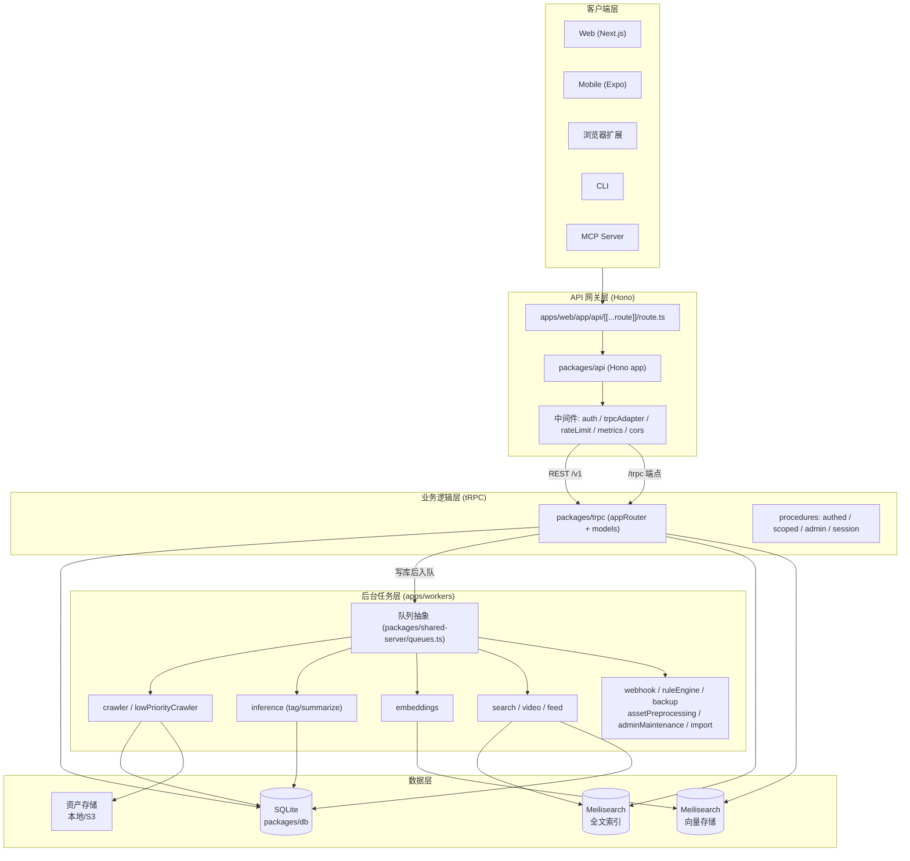
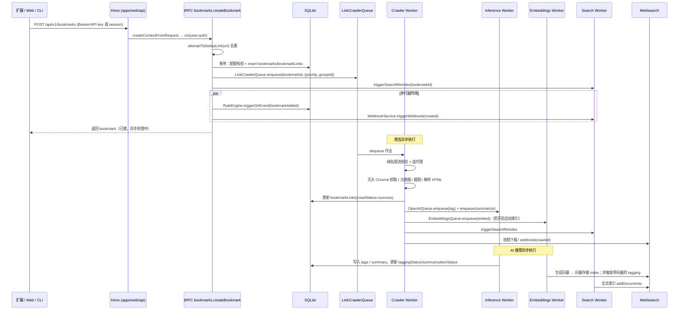
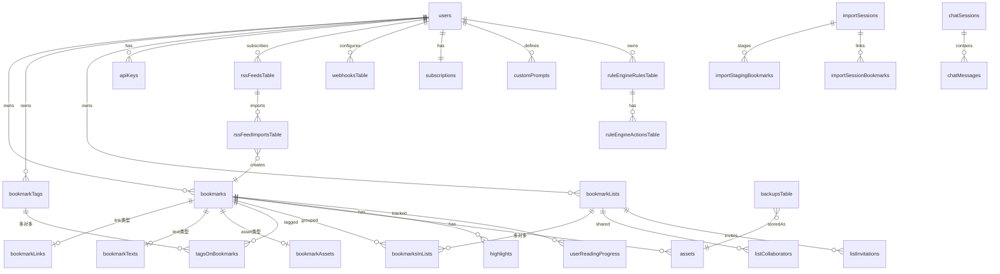
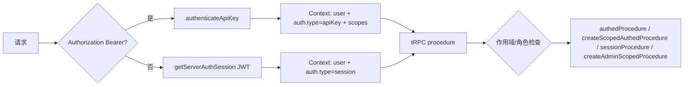
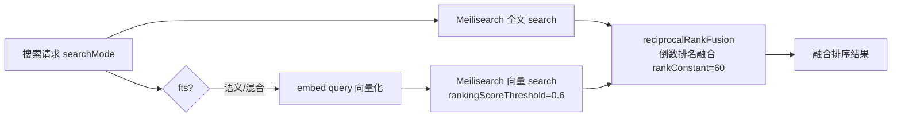
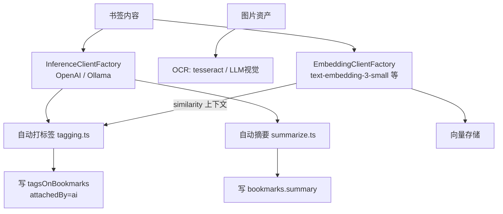
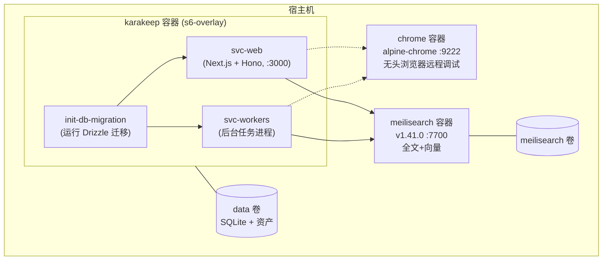
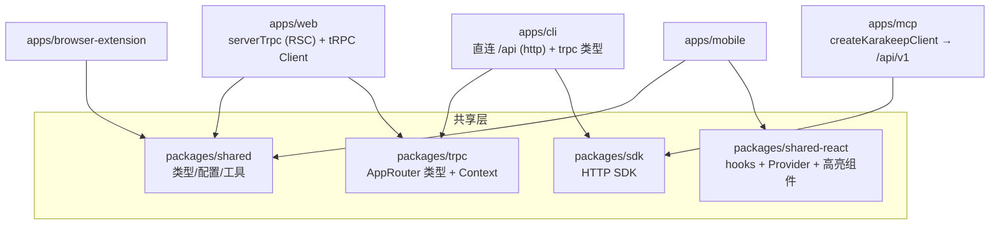

# Karakeep 架构文档

> 目录范围：/  （全项目架构总览）
>
> 本文基于代码库实际内容撰写，关键文件均给出相对路径引用以便跳转。
> 涉及无法从代码直接确认之处，会明确标注。

---

## 1. 项目概述

**Karakeep 是一个以"稍后阅读 / 书签收藏"为核心、面向 AI 增强的个人信息管理系统（"read-it-later" bookmarking app）。**

用户可以通过 Web、移动端（Expo）、浏览器扩展、CLI 或 MCP 把链接 / 文本 / 文件保存为书签，系统会自动完成：

- **网页抓取**（无头 Chrome 渲染、元数据提取、截图、PDF、全页归档、视频下载）
- **AI 推理**（自动打标签、自动摘要、图片 OCR、可选语义向量索引）
- **全文 + 语义混合搜索**
- **规则引擎、Webhook、RSS 订阅、协作清单、备份、导入/导出**等增值能力

项目采用 Turborepo + pnpm 管理的 monorepo 结构，前后端共享同一套 TypeScript 类型与业务逻辑（tRPC）。

---

## 2. 系统架构总览

Karakeep 是一个典型的**分层 + 异步任务**架构：同步请求走"客户端 → API 网关 → tRPC 业务逻辑 → 数据库"，耗时/可重试工作通过队列分发给独立 Workers 处理。

### 分层职责

| 层 | 关键包 | 职责 |
|---|---|---|
| 客户端 | `apps/web`, `apps/mobile`, `apps/browser-extension`, `apps/cli`, `apps/mcp` | UI 与用户交互，复用 `@karakeep/trpc` 类型 |
| API 网关 | `packages/api`, `apps/web/app/api/[[...route]]/route.ts` | Hono 路由、认证上下文注入、REST 与 tRPC 适配 |
| 业务逻辑 | `packages/trpc` | tRPC 路由、领域模型 (models)、规则引擎、搜索排序 |
| 数据 | `packages/db`, Meilisearch, 资产存储 | 持久化、全文索引、向量索引、二进制资产 |
| 后台任务 | `apps/workers`, `packages/shared-server` | 异步抓取、AI 推理、向量化、搜索索引、Webhook 等 |

---

## 3. 技术栈

| 维度 | 选型 |
|---|---|
| Monorepo | **Turborepo** + **pnpm**（workspace + hoisted，见 `pnpm-workspace.yaml`） |
| 前端 | Next.js (App Router)、React 19、TypeScript、Tailwind CSS、shadcn/ui |
| 移动端 | **Expo**（React Native 0.85）、NativeWind |
| 落地页 | **Astro** |
| 浏览器扩展 | Vite + React + Manifest |
| 后端框架 | **Hono**（轻量 Web 框架，挂载于 Next.js API Route） |
| RPC | **tRPC**（`superjson` transformer，端到端类型安全） |
| ORM | **Drizzle ORM**（SQLite 方言，`better-sqlite3` 驱动） |
| 数据库 | **SQLite**（见下方说明） |
| 搜索 / 向量 | **Meilisearch**（全文检索 + 向量存储） |
| AI 推理 | OpenAI 兼容 API / **Ollama**（本地） |
| 任务队列 | 自研队列抽象，可插拔实现（LiteQueue / Restate） |
| 部署 | Docker（s6-overlay 单容器 / 多容器 Compose） |
| 工具链 | Oxfmt（格式化）、oxlint（检查）、Vitest（测试）、Sherif（monorepo 规则） |
| 可观测性 | OpenTelemetry（tracing + event logs）、Prometheus 指标 |

> **关于数据库的说明**：项目 `AGENTS.md` 描述为"可能使用 PostgreSQL 或 SQLite"。但根据实际代码，`packages/db/drizzle.config.ts` 固定 `dialect: "sqlite"`，`packages/db/index.ts` 导出 `better-sqlite3` 的 `SqliteError`，`schema.ts` 全部使用 `drizzle-orm/sqlite-core`。**当前实现为 SQLite 专用**，PostgreSQL 支持无法从代码中确认。

> **关于认证的说明**：任务描述中提到 "better-auth"，但实际代码（`apps/web/server/auth.ts`）使用的是 **NextAuth (next-auth)**，配合 DrizzleAdapter。本文按实际实现描述。

---

## 4. Monorepo 结构

工作区由 `pnpm-workspace.yaml` 定义，包含 `apps/*`、`packages/*`、`tooling/*`、`tools/*`、`docs`。

### 4.1 应用 (`apps/`)

| 应用 | 包名 | 职责 |
|---|---|---|
| `apps/web` | `@karakeep/web` | **主应用**，Next.js，承载 UI、挂载 Hono API、认证、tRPC 服务端调用 |
| `apps/workers` | `@karakeep/workers` | **后台任务进程**，12+ 种 worker，独立 HTTP 指标服务 |
| `apps/mobile` | `@karakeep/mobile` | Expo 移动端，复用 `@karakeep/shared-react` hooks |
| `apps/browser-extension` | — | 浏览器扩展，支持 SingleFile 完整页面捕获 |
| `apps/cli` | `@karakeep/cli` | 命令行（书签/标签/清单/资产/管理员/导入等命令） |
| `apps/mcp` | `@karakeep/mcp` | Model Context Protocol 服务器，向 LLM 暴露 Karakeep 工具 |
| `apps/landing` | — | Astro 落地页 |

### 4.2 包 (`packages/`)

| 包 | 职责 |
|---|---|
| `packages/trpc` | **核心业务逻辑**：tRPC 路由聚合、领域模型、规则引擎、搜索排序、认证辅助 |
| `packages/api` | Hono 应用与 REST 路由（`/v1`）、中间件、tRPC 适配器 |
| `packages/db` | Drizzle schema、迁移、数据库连接 |
| `packages/shared` | 跨端共享：配置、类型、队列/搜索/向量/限流抽象、推理客户端、导入导出 |
| `packages/shared-server` | 服务端共享：队列定义、插件加载、事件日志、Tracing、配额服务 |
| `packages/shared-react` | 跨端 React：tRPC Provider、hooks（书签/清单/标签/高亮等）、高亮组件 |
| `packages/plugins` | 可插拔实现：Meilisearch 搜索/向量、LiteQueue/Restate 队列、内存/Redis 限流 |
| `packages/open-api` | OpenAPI 规范生成与 JSON |
| `packages/sdk` | 面向外部（CLI/MCP）的 HTTP SDK |
| `packages/e2e_tests` | 端到端测试（API、worker、资产存储） |
| `packages/benchmarks` | 性能基准 |

---

## 5. 核心数据流：创建一个书签

以"用户通过浏览器扩展 / Web 保存一个链接"为例，完整链路如下（基于 `packages/trpc/routers/bookmarks.ts` 的 `createBookmark` 与 `apps/workers/workers/crawlerWorker.ts` 的 `enqueuePostCrawlJobs`）。

### 关键实现细节

- **去重**：`createBookmark` 先查 `bookmarkLinks.url + userId` 命中则走"重新保存"路径（`RESAVE_EXEMPT_SOURCES` 中的 rss/import 保持幂等空操作），见 `packages/trpc/routers/bookmarks.ts:130`。
- **配额**：事务内调用 `QuotaService.canCreateBookmark`（`packages/shared-server/src/services/quotaService.ts`），超额抛 `FORBIDDEN`。
- **优先级队列**：根据用户是否触发高频限流或来源 `crawlPriority`，选择 `LinkCrawlerQueue`（默认）或 `LowPriorityCrawlerQueue`（低优先级，避免影响主队列并发），见 `bookmarks.ts:485`。
- **三态状态机**：`bookmarks` 表的 `taggingStatus` / `summarizationStatus` / `embeddingStatus` / `crawlStatus` 均为 `pending|success|failure`，驱动 UI 与重试。
- **爬虫后编排**：`crawlerWorker.ts` 的 `enqueuePostCrawlJobs` 把优先级透传给所有子作业，并按配置决定走"embeddings 链路（带向量 tagging）"还是"直接 OpenAI tagging"，见 `crawlerWorker.ts:266`。

---

## 6. 后台 Workers 架构

Workers 是独立的 Node 进程（`apps/workers`），与 Web 共享同一镜像（s6-overlay 启动）。入口 `apps/workers/index.ts` 通过 `workerBuilders` 映射构造各 worker，并按 `WORKERS_ENABLED_WORKERS` / `WORKERS_DISABLED_WORKERS` 环境变量过滤启停。

### 6.1 队列抽象与实现

队列在 `packages/shared/queueing.ts` 定义接口（`Queue` / `QueueClient` / `Runner` / `DequeuedJob`），支持优先级、幂等键 (`idempotencyKey`)、`groupId`、`delayMs`、重试、`QueueRetryAfterError`（不计重试次数的延迟重试，用于域名限流）。

具体队列实例在 `packages/shared-server/src/queues.ts` 用 `createDeferredQueue`（懒加载，首用才初始化插件）声明，例如：

| 队列 | payload 摘要 | 重试 | 用途 |
|---|---|---|---|
| `LinkCrawlerQueue` | `{bookmarkId, runInference, archiveFullPage, storePdf}` | 5 | 默认网页抓取 |
| `LowPriorityCrawlerQueue` | 同上 | 5 | 导入/RSS 等低优先级抓取 |
| `OpenAIQueue` | `{bookmarkId, type: summarize|tag, embedding?}` | 3 | AI 打标签 / 摘要 |
| `EmbeddingsQueue` | `{type: embed|index|delete, ...}` | 3 | 向量生成/索引/删除 |
| `SearchIndexingQueue` | `{bookmarkId, type: index|delete}` | 5 | 全文索引同步 |
| `VideoWorkerQueue` | `{bookmarkId, url}` | 5 | 视频下载（yt-dlp） |
| `FeedQueue` | `{feedId}` | 1 | 单条 RSS 抓取 |
| `WebhookQueue` | `{bookmarkId, operation, userId?}` | 3 | Webhook 投递 |
| `RuleEngineQueue` | `{bookmarkId, events[]}` | 1 | 规则引擎评估 |
| `BackupQueue` | `{userId, backupId?}` | 2 | 用户备份生成 |
| `AssetPreprocessingQueue` | `{bookmarkId, fixMode}` | 2 | 资产预处理（图片/PDF/OCR） |
| `AdminMaintenanceQueue` | `{type: tidy_assets|migrate_large_link_html}` | 1 | 管理员维护任务 |

队列实现通过**插件**注入（`packages/shared-server/src/plugins.ts:loadAllPlugins`）：`queue-liteque`（默认，进程内）/ `queue-restate`（基于 Restate，分布式）。`PluginManager` 对同一类型"后注册者胜"。

### 6.2 Worker 职责清单

| Worker | 文件 | 职责 |
|---|---|---|
| **crawler** | `workers/crawlerWorker.ts` | 无头 Chrome 渲染抓取、元数据（metascraper）、截图/PDF/全页归档、HTML 解析（子进程，内存受限）、反广告/同意弹窗（autoconsent）、代理、域名限流 |
| **inference** | `workers/inference/inferenceWorker.ts` | 调用 OpenAI/Ollama 做打标签（`tagging.ts`）与摘要（`summarize.ts`） |
| **embeddings** | `workers/embeddingsWorker.ts` | 生成向量 → 派发 `index` 持久化 + 带 similarity 上下文的 tagging；失败仍兜底 tagging |
| **search** | `workers/searchWorker.ts` | 把书签文档写入 Meilisearch 全文索引（支持批处理） |
| **video** | `workers/videoWorker.ts` | yt-dlp 下载视频资产 |
| **feed** | `workers/feedWorker.ts` + `FeedRefreshingWorker` | 周期拉取 RSS 并创建书签；`FeedRefreshingWorker` 调度周期 |
| **import** | `workers/importWorker.ts` | 轮询 `importStagingBookmarks`，逐条创建（走低优先级队列） |
| **webhook** | `workers/webhookWorker.ts` | 投递用户配置的 webhook（created/edited/crawled/ai tagged/deleted） |
| **ruleEngine** | `workers/ruleEngineWorker.ts` | 评估用户规则并执行动作（加标签/加入清单） |
| **backup** | `workers/backupWorker.ts` + `BackupSchedulingWorker` | 按用户频率生成备份资产；`BackupSchedulingWorker` 周期入队 |
| **assetPreprocessing** | `workers/assetPreprocessingWorker.ts` | 图片/PDF 处理、OCR |
| **adminMaintenance** | `workers/adminMaintenanceWorker.ts` | 清理悬挂资产、迁移大段 HTML 到资产 |

### 6.3 可靠性与可观测性

- 每个 worker 用 `withWorkerTracing` + `withWorkerEventLog` 包装 `run`，产出 OTel span 与事件日志。
- `metrics.ts` 暴露 Prometheus 指标（`workerStatsCounter`、`bookmarkCrawlLatencyHistogram`），通过 `apps/workers/server.ts` 的 HTTP 服务在 `WORKERS_HOST:WORKERS_PORT` 暴露。
- 永久失败时（`numRetriesLeft == 0`）清理状态字段，避免 UI 永久停在 `pending`（见 `crawlerWorker.ts` 的 `onError`）。

---

## 7. 数据库设计

基于 `packages/db/schema.ts`（Drizzle SQLite）。下表为核心实体关系（ER 图）。

### 7.1 主要表说明

| 表 | 关键字段 | 说明 |
|---|---|---|
| `users` | `role(admin\|user)`, `bookmarkQuota`, `storageQuota`, AI/阅读器/备份等设置 | 用户与配置中心；首位注册者自动成为 admin |
| `accounts` / `sessions` / `verificationTokens` / `passwordResetTokens` | OAuth account、JWT 会话、验证令牌 | NextAuth 标准 adapter 表 |
| `apiKeys` | `keyId`, `keyHash`(SHA256), `scopes`(JSON), `lastUsedAt` | API 密钥，`ak2_<keyId>_<secret>` 格式 |
| `bookmarks` | `type(link\|text\|asset)`, `source`, `taggingStatus/summarizationStatus/embeddingStatus`, `createdAt`(实为 lastSavedAt) | **核心表**，含三态状态机 |
| `bookmarkLinks` | `url`, `htmlContent`, `contentAssetId`, `crawlStatus`, `readerViewStatus/Score/Reasons`, `probeMetadataAt` | 链接抓取结果与可读性评估 |
| `bookmarkTexts` / `bookmarkAssets` | 文本/资产内容 | 按 type 分表（共享 bookmark.id） |
| `assets` | `assetType`(枚举: 截图/PDF/视频/归档/头像/备份等), `size`, `bookmarkId` | 二进制资产元数据，实体在本地/S3 |
| `bookmarkTags` | `name`, `normalizedName`(生成列: lower 去分隔符) | 标签，`attachedBy(ai\|human)` 区分来源 |
| `tagsOnBookmarks` | `bookmarkId+tagId` 主键, `attachedBy` | 书签-标签多对多 |
| `bookmarkLists` | `type(manual\|smart)`, `query`(智能清单), `parentId`(嵌套), `public`, `rssToken` | 手动/智能清单，支持嵌套与公开 |
| `bookmarksInLists` / `listCollaborators` / `listInvitations` | `role(viewer\|editor)` | 协作清单与邀请 |
| `highlights` | `startOffset/endOffset`, `color`, `text`, `note` | 网页/文本高亮 |
| `userReadingProgress` | `readingProgressPercent/Offset/Anchor` | 阅读进度 |
| `customPrompts` | `appliesTo(all_tagging\|text\|images\|summary)` | 用户自定义 AI 提示词 |
| `chatSessions` / `chatMessages` | `role(user\|assistant\|toolResult)`, `metadata` | 实验性 AI 对话 |
| `rssFeedsTable` / `rssFeedImportsTable` | `url`, `lastFetchedStatus`, `entryId` | RSS 订阅与去重导入记录 |
| `webhooksTable` | `url`, `events[]`, `token` | Webhook 配置 |
| `ruleEngineRulesTable` / `ruleEngineActionsTable` | `event`, `condition`, `action`, `tagId/listId` | 规则引擎（事件→条件→动作） |
| `subscriptions` | `stripeCustomerId`, `tier(free\|paid)`, `status` | Stripe 订阅 |
| `importSessions` / `importStagingBookmarks` | `status`, `result`, 进度计数 | 两阶段导入（staging→processing） |
| `backupsTable` | `assetId`, `status`, `size`, `bookmarkCount` | 用户备份 |
| `invites` | `email`, `token` | 邀请注册 |

### 7.2 设计亮点

- **`bookmarks.createdAt` 字段名与列名刻意不一致**：`createdAt` 字段实际映射到 `lastSavedAt` 列（重新保存即置顶），原始创建时间在 `dbCreatedAt` 列（对外暴露为 `firstCreatedAt`）。见 `schema.ts:220` 注释。
- **`normalizedName` 生成列**：用 SQL 表达式 `lower(replace(...))` 自动归一化标签名，配合唯一约束避免大小写/分隔符重复。
- **复合索引优化分页**：如 `bookmarks_userId_archived_lastSavedAt_id_idx` 直接服务于按状态筛选 + 时间排序的游标分页。
- **协作清单的成员关系**：`bookmarksInLists.listMembershipId` 关联 `listCollaborators`，成员退出时级联清理条目。

---

## 8. 认证与授权机制

认证在 Web 侧由 NextAuth 负责（`apps/web/server/auth.ts`），API 侧由 Hono 中间件 + tRPC context 负责。

### 8.1 认证方式

- **会话认证**：NextAuth，JWT 策略（`session.strategy: "jwt"`）。凭据 Provider 调用 `validatePassword`（`packages/trpc/auth.ts`），bcrypt 校验 `password + salt`。
  - **防时序攻击**：用户不存在或无密码时，仍与 `DUMMY_PASSWORD_HASH`（随机值的真实 bcrypt hash）做一次 compare，抹平时延。
  - **登录限流**：开启 `RATE_LIMITING_ENABLED` 时按 `login:<ip>:<email>` 限流（15 分钟 10 次）。
  - **OAuth**：支持自定义 OIDC Provider（`OAUTH_WELLKNOWN_URL`），仅信任非对称签名算法；首位/管理员判定角色。
- **API Key 认证**：`apps/web/server/api/client.ts:createContextFromRequest` 优先解析 `Authorization: Bearer`。
  - 格式 `ak2_<keyId>_<secret>`（v2 用 SHA256 + `timingSafeEqual`）；`ak1_` 为旧版 bcrypt。
  - `lastUsedAt` 10 分钟节流更新，避免高频写库。
  - `scopes`（JSON）控制细粒度访问；默认 `API_KEY_FULL_ACCESS_SCOPE`。

### 8.2 授权层级（`packages/trpc/index.ts`）

| Procedure 工厂 | 适用场景 |
|---|---|
| `publicProcedure` | 公开接口，默认全局限流（60s/1000） |
| `authedProcedure` | 需登录，默认限流（60s/3000） |
| `sessionProcedure` | 仅允许会话认证，**拒绝 API Key** |
| `createScopedAuthedProcedure(resource)` | 按 API Key 资源作用域校验（read/readwrite） |
| `createAdminScopedProcedure(resource)` | 管理员角色 + 作用域双重校验 |

- **首个用户即 admin**：`isFirstUser()` 在注册时判定（`auth.ts`）。
- **Cloudflare Turnstile**：可选人机校验（`lib/turnstile.ts`）。
- **邮件验证**：`EMAIL_VERIFICATION_REQUIRED` 开启时强制（需配置 SMTP）。

---

## 9. 搜索与 AI 能力

### 9.1 混合搜索架构

Karakeep 提供 **FTS（全文）/ 语义（向量）/ 混合** 三种搜索模式（`packages/trpc/routers/bookmarks.ts` 的 `searchBookmarks`）。

- **全文索引**：`SearchIndexClient`（`packages/shared/search.ts`），文档含 `title/description/content/note/summary/tags/...`，实现为 `packages/plugins/search-meilisearch`。
- **向量存储**：`VectorStoreClient`（`packages/shared/vectorStore.ts`），实现为 `packages/plugins/vectorstore-meilisearch`，用 `BatchingDocumentQueue` 批量写入。
- **融合算法**：`reciprocalRankFusion`（`packages/trpc/lib/searchRanking.ts`），忽略异质分数，按排名倒数加权，两源都命中的结果自然上升。
- **语义限流**：非 fts 模式走独立的 `semanticSearchRateLimitMiddleware`（60s/300）。
- **搜索查询语法**：`packages/shared/searchQueryParser.ts` 解析结构化查询（标签、清单、收藏等过滤）。

### 9.2 AI 推理管线

- **模型可插拔**：`INFERENCE_TEXT_MODEL` / `INFERENCE_IMAGE_MODEL` / `EMBEDDING_TEXT_MODEL`，支持 OpenAI 兼容端点与本地 Ollama（`packages/shared/inference.ts`）。
- **结构化输出**：`INFERENCE_OUTPUT_SCHEMA`（structured/json/plain）适配不同模型能力。
- **用户可控**：`users.autoTaggingEnabled` / `autoSummarizationEnabled` / `tagStyle` / `curatedTagIds` / `inferredTagLang` 精细控制；`customPrompts` 注入自定义提示词。
- **embeddings → tagging 联动**：开启自动索引时，embeddings worker 生成向量后会把向量随 tagging 作业传递，使 tagging 能借助 `search({vector})` 获取相似书签上下文（见 `queues.ts` 的 `zOpenAIRequestSchema.embedding`）。
- **实验性 Chat**：`CHAT_ENABLED` + `chatSessions/chatMessages` 表支持基于书签库的对话。

---

## 10. 部署架构

### 10.1 Docker Compose（推荐自托管）

`docker/docker-compose.yml` 使用**单容器镜像**（s6-overlay 同时运行 web 与 workers），配合两个外部依赖容器：

- **环境注入**：`MEILI_ADDR=http://meilisearch:7700`、`BROWSER_WEB_URL=http://chrome:9222` 由 compose 注入；`OPENAI_API_KEY` 等在 `.env`。
- **数据卷**：`data` 卷存放 SQLite (`db.db`) 与资产（`DATA_DIR=/data`）；`meilisearch` 卷存放索引。
- **变体**：`docker-compose.dev.yml`（开发）、`docker-compose.build.yml`（构建）、`Dockerfile.dev`，以及通过 `USING_LEGACY_SEPARATE_CONTAINERS` 兼容旧的 web/workers 分离容器部署。
- **资产存储**：默认本地文件系统（`assetsDir`），配置 `ASSET_STORE_S3_*` 后切换到 S3（`packages/shared/config.ts` 的 `assetStore.type`）。

### 10.2 生产拓扑要点

- Web 与 Workers 共享同一 `DB`（SQLite 文件），WAL 模式可由 `DB_WAL_MODE` 开启。
- 指标：Web 经 `packages/api/routes/metrics.ts`、Workers 经独立 HTTP 服务，均受 `PROMETHEUS_AUTH_TOKEN` 保护。
- 可选组件：Redis（`REDIS_URL`）用于分布式限流与 Restate 队列；OpenTelemetry Collector（`OTEL_EXPORTER_OTLP_*`）用于 tracing 与事件日志导出；Stripe（`STRIPE_*`）用于订阅计费。

> Kubernetes：任务描述提及"可选 Kubernetes"，但仓库内未见 Helm/K8s 清单，此能力无法从代码确认。

---

## 11. 跨平台客户端如何复用 packages

所有客户端共享同一份 tRPC 类型与部分前端逻辑，实现"一次定义，多端复用"。

- **Web**：服务端用 `apps/web/server/api/trpc.ts` 的 `serverTrpc`（`@trpc/tanstack-react-query` proxy，RSC 内调用）；客户端用 `@karakeep/shared-react/providers/trpc-provider`。
- **Mobile**：复用 `shared-react` 的 hooks（`useBookmarks` / `useLists` / `useTags` 等）与高亮组件，配置自建服务器地址（`server-address.tsx`）。
- **浏览器扩展**：通过 `utils/trpc.ts` 连接 Karakeep 实例，支持 SingleFile 完整页面归档并上传为 `precrawledArchiveId`。
- **CLI / MCP**：不直接连 tRPC，而通过 `packages/sdk` 调用 REST `/api/v1`（Bearer API Key 认证），保证跨网络可用。
- **类型单一来源**：`AppRouter = typeof appRouter`（`packages/trpc/routers/_app.ts`）作为唯一类型定义，被各端导入。

---

## 12. 关键设计决策与亮点

1. **Hono 挂载于 Next.js**：通过 `apps/web/app/api/[[...route]]/route.ts` 的 catch-all route + `hono/vercel` 的 `handle`，让 Next.js 同时承担前端渲染与 API 网关，避免独立后端进程；tRPC 既可走 `/api/trpc`，业务能力又通过 `/api/v1` REST 暴露（`packages/api/routes/trpc.ts` 复用 tRPC caller）。

2. **tRPC 作为业务逻辑单一来源**：`packages/trpc` 集中 18 个路由 + 领域模型 (`models/`)，REST 路由与 CLI/MCP 全部复用同一 caller，杜绝逻辑分叉。

3. **可插拔基础设施（Plugin 架构）**：搜索、向量、队列、限流四种能力均抽象为接口（`packages/shared`）+ 插件实现（`packages/plugins`），由 `PluginManager` 按"后注册者胜"选择，便于自托管（内存/LiteQueue）与云部署（Redis/Restate/Meilisearch）无缝切换。

4. **状态机驱动的异步处理**：`bookmarks` 表用多组 `pending/success/failure` 状态字段精确反映抓取、tagging、summarization、embedding 进度，前端可清晰展示"处理中/完成/失败"。

5. **两阶段导入 + 低优先级队列隔离**：`importStagingBookmarks` 先落库再由 `importWorker` 轮询消费，并走 `LowPriorityCrawlerQueue`，避免大批导入挤占用户实时抓取并发。

6. **安全细节**：API Key 用 `timingSafeEqual` 恒定时间比较；登录路径用 `DUMMY_PASSWORD_HASH` 抵御用户枚举时序攻击；OAuth 仅信任非对称签名；域名级爬虫限流 + `QueueRetryAfterError` 带抖动退避。

7. **混合搜索的 RRF 融合**：避开 FTS 与向量分数不可比的问题，用倒数排名融合让两源共同命中的结果自然居前，`SEMANTIC_SCORE_THRESHOLD=0.6` 过滤向量噪声。

8. **embed → tag 联动优化**：向量化完成后把向量随 tagging 作业下发，使 AI 打标签可借助相似书签上下文，且向量索引失败不会重触发 tagging（职责拆分为 `embed/index/delete` 三类作业）。

9. **可观测性内建**：从 tRPC procedure 级别的请求耗时/计数，到 worker 级 tracing + 事件日志，再到 Prometheus 指标，形成贯穿同步/异步链路的可观测体系。

---

## 13. 相关文档

- [AGENTS.md](../AGENTS.md) - 项目概览与开发工作流（命令、约定）
- [配置选项文档](docs/03-configuration.md) - 环境变量与配置详解（`packages/shared/config.ts` 的全部项）
- [packages/trpc/README 无] - tRPC 路由源码即文档：`packages/trpc/routers/_app.ts`
- [OpenAPI 规范](../packages/open-api/karakeep-openapi-spec.json) - REST `/api/v1` 自动生成的 OpenAPI 描述
- [Docker 部署示例](../docker/docker-compose.yml) - 自托管编排参考

---

> 本文档基于代码库实际内容撰写。如发现描述与代码不符，以代码为准。
