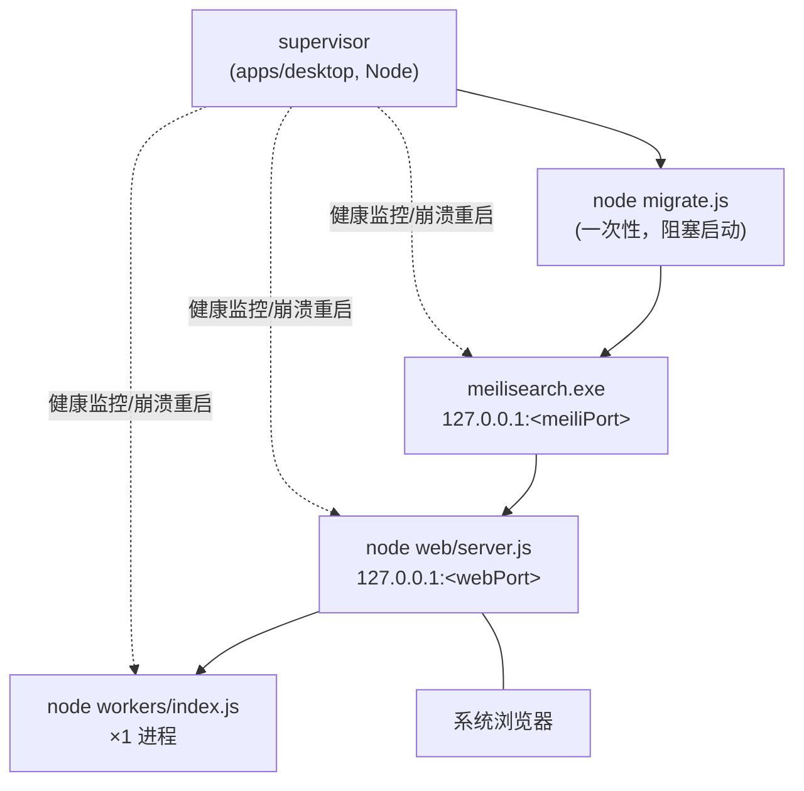

# Karakeep 桌面版 Phase 0 详细设计

> 版本：v1.0
> 日期：2026-09-02
> 状态：待评审
> 前置决策：Windows only · 脱离 Docker 单机使用 · AI 维持 OpenAI 兼容端点 · v1 无同步
> 关联文档：[ARCHITECTURE.md](./ARCHITECTURE.md)、[PI_AGENT_ARCHITECTURE_DESIGN.md](./PI_AGENT_ARCHITECTURE_DESIGN.md)

---

## 1. 目标与范围

### 1.1 目标

在**不引入 Rust/Tauri 工具链**的前提下，交付一个 Windows 单机版最小可用形态：

```
supervisor 进程（后台）→ 拉起 web + workers + meilisearch → 系统浏览器打开 http://127.0.0.1:<port>
```

验证三件事：**sidecar 进程管理可行**、**无 Docker 运行可接受**、**无浏览器抓取可接受**。

### 1.2 范围内 / 范围外

| 范围内 | 范围外（后续阶段） |
|---|---|
| supervisor（进程管理/端口/密钥/日志/自动重启/优雅退出） | Tauri 窗口与 WebView（Phase 1） |
| 本地模式免登录（env 门控，单一收口） | 托盘精修、全局快捷键（Phase 1；M0.2 可选简版） |
| Windows 打包（standalone + 二进制捆绑 + zip 分发） | 安装器（NSIS）、自动更新、代码签名 |
| 首启流程（建目录/生成密钥/迁移/开浏览器） | mac/Linux、同步、本地模型默认端 |

---

## 2. 进程拓扑与目录规划

### 2.1 进程拓扑



启动顺序固定：**迁移 → meilisearch → web（探活 /api/health）→ workers → 打开浏览器**。
关停顺序相反：**workers → web → meili**，5s 超时后 `taskkill /T /F` 树杀。

### 2.2 用户数据目录（与安装目录分离，升级不丢数据）

```
%APPDATA%\karakeep-desktop\
├─ config.json        # 端口、密钥、用户透传 env（OPENAI_* 等）
├─ data\              # DATA_DIR：sqlite + assets\
├─ meili\             # meilisearch --db-path
├─ logs\              # supervisor/meili/web/workers 按日滚动
└─ instance.lock      # 单实例锁
```

安装目录（分发 zip 解压即用）：

```
karakeep-desktop\
├─ karakeep.cmd       # 入口（Phase 1 换 Tauri exe）
├─ node\node.exe      # 官方 win-x64 zip，锁 24.x
├─ runtime\
│  ├─ migrate\        # ncc 产物 migrate.js + drizzle\（复用 Docker 构建方法）
│  ├─ web\            # .next/standalone + public + .next/static + mermaid dist 补丁
│  └─ workers\        # tsdown 产物 + pnpm deploy --prod 依赖
├─ bin\
│  ├─ meilisearch.exe # v1.41.0 win-amd64（与 docker-compose 一致）
│  ├─ ffmpeg.exe      # + dll（video worker / 音频转码）
│  ├─ yt-dlp.exe      # 视频抓取
│  └─ monolith.exe    # 可选，缺失不阻塞
└─ resources\
```

---

## 3. Supervisor 设计（apps/desktop 新包）

### 3.1 职责

| 职责 | 说明 |
|---|---|
| 单实例 | 对 `instance.lock` 独占打开；已运行则聚焦（直接再开浏览器）后退出 |
| 配置管理 | 首启生成 `config.json`：webPort/meiliPort（空闲端口探测）、NEXTAUTH_SECRET、MEILI_MASTER_KEY（随机 ≥32 字节） |
| 子进程生命周期 | 崩溃自动重启：指数退避（1s/2s/4s/8s/16s），5 分钟窗口内超 5 次则停服并在托盘/日志报错 |
| 健康探测 | web：轮询 `GET /api/health`（200 即绪）；meili：`GET /health` |
| 日志 | 子进程 stdout/stderr → `logs/<name>-YYYYMMDD.log`，保留 14 天 |
| 退出 | 监听 Ctrl+C / `process.exit`；反向树杀；supervisor 自身被强杀时子进程随 job 对象回收（**已确认（M0.2）**：直接 spawn 无 shell 时 Job Object 整树回收；`shell:true` 会残留孙进程，故 supervisor 直接 spawn 真实进程） |

### 3.2 环境变量注入表（supervisor → 子进程）

| 变量 | web | workers | 说明 |
|---|---|---|---|
| `DATA_DIR` | ✓ | ✓ | `%APPDATA%\karakeep-desktop\data` |
| `MEILI_ADDR` | ✓ | ✓ | `http://127.0.0.1:<meiliPort>` |
| `MEILI_MASTER_KEY` | ✓ | ✓ | config.json |
| `PORT` / `HOSTNAME` | ✓ | — | webPort / `127.0.0.1` |
| `NEXTAUTH_URL` / `NEXTAUTH_URL_INTERNAL` | ✓ | — | `http://127.0.0.1:<webPort>` |
| `NEXTAUTH_SECRET` | ✓ | — | config.json |
| `API_URL` | ✓ | — | `http://127.0.0.1:<webPort>` |
| `KARAKEEP_LOCAL_MODE` | ✓ | — | `true`（见 §4） |
| `DISABLE_NEW_RELEASE_CHECK` | ✓ | ✓ | `true`（本地版无升级检查意义） |
| `WORKERS_DISABLED_WORKERS` | — | ✓ | 默认空；用户可在 config.json 裁剪（如 video） |
| `BROWSER_WEB_URL` | — | ✗ 不设置 | **不设即走无浏览器抓取降级路径** |
| `OPENAI_*` / `OLLAMA_*` / `CHAT_MODEL` | ✓ | ✓ | 从 config.json `userEnv` 透传 |
| `FFMPEG_PATH` / `YTDLP_PATH`（如已支持） | — | ✓ | 指向 bin\（若现有实现用 PATH 查找，则 supervisor 把 bin\ 注入 PATH，M0.1 确认） |

### 3.3 首启流程（First Run）

```
1. 建目录结构 + 写 config.json（生成密钥/选端口）
2. node runtime/migrate/migrate.js     # 幂等：drizzle 只应用 pending 迁移
3. meilisearch --db-path ... --master-key ... --no-analytics（后台）
4. web server.js（后台）→ 轮询 /api/health 至 200（超时 60s 报错）
5. workers index.js（后台）
6. start http://127.0.0.1:<webPort>    # 系统默认浏览器
```

后续启动复用 config.json，重复 2-6（迁移幂等）。

---

## 4. 本地模式认证设计（改动面：1 个函数）

### 4.1 现状事实

- NextAuth v4，Credentials Provider，**session 策略为 JWT**（[auth.ts:209-211](../apps/web/server/auth.ts)），无法靠插 DB session 行造会话；
- 全 web 应用的会话解析**唯一收口**是 `getServerAuthSession`（[auth.ts:302](../apps/web/server/auth.ts)），tRPC context、root layout、signin/signup/invite 页面全部经它取 session。

### 4.2 方案：env 门控的收口旁路

```text
getServerAuthSession():
  if (serverConfig.localMode)            # KARAKEEP_LOCAL_MODE=true
    return 合成 session { user: { id: localUserId, role: "admin", name: "Local User" } }
  return getServerSession(authOptions)   # 原逻辑不动
```

- `localUserId` 懒创建：users 表为空时插入 `local@desktop.karakeep.local`（随机不可用密码哈希，role=admin）；非空时取该 email 用户；
- **不改**任何 procedure、不改 NextAuth 回调、服务端默认行为零变化（env 未开时走原路径）；
- 首启即免登录直达 dashboard，无需登录页/令牌 URL/cookie 注入（系统浏览器场景下 cookie 注入本就不可行）。

### 4.3 改动清单

| 位置 | 内容 | 规模 |
|---|---|---|
| [config.ts](../packages/shared/config.ts) | 新增 `KARAKEEP_LOCAL_MODE: stringBool("false")` → `serverConfig.localMode`（带 KARAKEEP_ 前缀避免裸 LOCAL_MODE 与其他软件的全局 env 冲突） | ~3 行 |
| [auth.ts](../apps/web/server/auth.ts) | `getServerAuthSession` 旁路 + 懒建 local user | ~30 行 |

### 4.4 安全边界（明示风险）

本地模式 = 信任 loopback。绑定 127.0.0.1 时，**本机任何进程**都能以 admin 身份访问 API。这与 meilisearch（127.0.0.1 + master key）同属单用户桌面的既有信任域，Phase 0 接受；Phase 1 若需收紧，可在该收口校验请求来源进程（Windows 可查询 TCP owning PID），不阻塞当前设计。

---

## 5. 打包设计

### 5.1 构建脚本（`apps/desktop/scripts/build.mjs`，Windows 或 CI windows runner 执行）

```
1. pnpm build                                   # turbo 全量构建
2. runtime/migrate：ncc build packages/db/migrate.ts + 拷贝 drizzle/   # 复用 Dockerfile:71-73 已验证方法
3. runtime/web：
   cp .next/standalone → runtime/web
   cp public、.next/static                       # standalone 不含二者
   补丁：packages/trpc/node_modules/@plait-board/mermaid-to-drawnix/dist
        → runtime/web/node_modules/.../dist      # Turbopack tracing 缺口，Dockerfile:184-188 已踩坑
4. runtime/workers：pnpm deploy --prod --filter=@karakeep/workers  # 复用 Dockerfile:81
5. bin/：下载锁定版本二进制（本地缓存目录，可重入）：
   - meilisearch v1.41.0 win-amd64（与 docker-compose.yml:35 对齐）
   - ffmpeg（essentials win64）→ 解压取 exe+dll
   - yt-dlp（单 exe，--js-runtimes node）
   - monolith win build（可选；404 则跳过并记 warning）
6. node/node.exe：官方 win-x64 zip（版本 = better-sqlite3 prebuilds 支持的 24.x，与构建机一致）
7. 产出 dist/karakeep-desktop/ + karakeep-desktop-<version>-win-x64.zip
```

安装时无需 `pnpm install`：所有 node_modules 均为构建期产物，目标机零依赖。

### 5.2 体积预算（待 M0.4 实测校准）

| 组件 | 预算 |
|---|---|
| node.exe | ~80 MB |
| web standalone + static | ~120-180 MB |
| workers 依赖（playwright **不下载浏览器**，沿用 `PLAYWRIGHT_SKIP_BROWSER_DOWNLOAD=1`） | ~150-250 MB |
| meilisearch.exe | ~50 MB |
| ffmpeg + yt-dlp | ~100 MB |
| **合计（安装后）** | **~500-650 MB；zip 分发 ~250-350 MB** |

若超标，第一刀砍 ffmpeg/yt-dlp（改为可选下载包，禁用 video worker）。

### 5.3 Windows 已知坑清单

| # | 坑 | 对策 |
|---|---|---|
| 1 | 未签名 exe → SmartScreen 警告 | Phase 0 自用接受；README 说明"更多信息→仍要运行"；Phase 1 签名 |
| 2 | better-sqlite3 与 node.exe 版本错配 ABI | node.exe 版本锁死 = 构建机 Node 24.x；升级需同步重测 |
| 3 | tesseract.js 运行时从 CDN 拉 WASM/语言包 | 首次 OCR 需联网；断网时 OCR 失败（抓取不受阻）。可选：捆绑 eng.traineddata |
| 4 | git 检出 CRLF 影响脚本 | 产物内均为 ncc/tsdown 单文件或 .js，Node 执行不受行尾影响；cmd 入口自写 |
| 5 | meilisearch win 包某版本缺失 | 构建脚本硬校验下载产物存在，缺失即 fail（monolith 除外，可跳过） |
| 6 | 子进程孤儿（supervisor 被强杀） | 已消除（M0.2 实证：Job Object 整树回收） | 兜底：启动时清理带本实例标记的残留进程 |

---

## 6. 新增/修改代码面总览

| # | 位置 | 类型 | 内容 | 复杂度 |
|---|---|---|---|---|
| 1 | `apps/desktop/`（新） | 新包 | supervisor（lifecycle/config/procs/logging）+ build.mjs + karakeep.cmd | 中 |
| 2 | `packages/shared/config.ts` | 修改 | +`KARAKEEP_LOCAL_MODE` | 低 |
| 3 | `apps/web/server/auth.ts` | 修改 | `getServerAuthSession` 本地旁路 | 低 |
| 4 | `docs/` | 新增 | 桌面版使用说明（含 AGPL 源码获取指引） | 低 |

预计净新增 ~800-1200 行，**不触碰** tRPC 业务路由、DB schema、workers 业务逻辑。

---

## 7. 里程碑与验收

### M0.1 脚本原型（开发机，不打包）✅ 已完成（2026-09-02）
用 pnpm 直接拉起三进程 + `KARAKEEP_LOCAL_MODE=true`。
**验收**：浏览器免登录可用；保存 URL 抓取成功（确认无 BROWSER_WEB_URL 的降级路径存在且质量可接受，产出降级页面清单）；搜索、AI 聊天（配 OPENAI_API_KEY）可用。

**完成记录**：
- 实现：`packages/shared/config.ts`（`KARAKEEP_LOCAL_MODE`）、`apps/web/server/auth.ts`（`getServerAuthSession` 本地旁路，懒建 `local@desktop.karakeep.local` admin）、`apps/desktop/scripts/dev.mjs`（迁移 + meili + web + workers 四子进程、健康探活、config.json 端口回写）。
- 验证结果：免登录访问 `/`（307→dashboard，whoami=Local User）✓；保存 qq.com 抓取全链路 success（标题/描述/favicon/banner 资产入库，AI 打标与摘要 success，复用既有 bigmodel 配置）✓；搜索 `bookmarks.searchBookmarks`（fts）命中本地 meili ✓；typecheck 通过（workers 包 0 错误；CanvasEditor.tsx 为 fork 既有无关错误）✓。
- AI 聊天未单独验证（推理链已经 tagging/summarization 验证），随 M0.4 一并覆盖；10 站点降级抽样留待 M0.4 验收项 3（本阶段：qq.com 纯 fetch 降级路径质量可接受；百度搜索页被反爬验证码拦截，属站点特性）。
- **Windows 实测发现与修复**（均已在代码中处理）：
  1. Docker Desktop 在 ：3000 发布端口导致 next dev EADDRINUSE 后 curl 误打 Docker 实例（401 假象）→ dev.mjs 复用配置时复查端口并回写（本次 web 实际跑 ：3001）；
  2. 本机系统 DNS=127.0.0.1（代理工具残留、服务未跑），Node c-ares 直连全部 ECONNREFUSED → `apps/workers/network.ts` `resolveHostAddresses` 增加 getaddrinfo 回退（仅原抛错路径，SSRF 校验不受影响）；
  3. parse 子进程 `new URL().pathname` 在 Windows 产生 `/F:/...` 非法路径，且裸 `tsx`（.cmd）无法被 spawn → `parseSubprocess.ts` 改 `fileURLToPath` + `process.execPath` + `require.resolve("tsx/cli")`；
  4. adblocker 过滤列表从 raw.githubusercontent.com 下载，国内网络挂起阻塞 crawler 启动 → dev.mjs 注入 `CRAWLER_ENABLE_ADBLOCKER=false`（M0.3 打包时同样注入）；
  5. 反复强杀进程会损坏 Turbopack `.next` dev 缓存（路由全 404），删除 `apps/web/.next` 恢复。
- 实测体积：meilisearch v1.41.0 win-x64 为 129 MB（§5.2 已校准）。

### M0.2 supervisor 成型 ✅ 已完成（2026-09-02）
单实例/密钥/端口/日志/自动重启/优雅退出。
**验收**：杀任一子进程 10s 内自愈；Ctrl+C 无残留进程；二次启动幂等。
（可选）systray2 托盘：打开 / 退出 / 打开日志目录，不稳则退化为控制台窗口。

**完成记录**：
- 实现（全部在 `apps/desktop/scripts/dev.mjs`，~500 行）：
  - 单实例锁 `WS/instance.lock`（JSON：supervisor + 三子进程 pid，存活校验 `process.kill(pid,0)`；已运行→仅重开浏览器退出 0；残留→树杀接管）；
  - 日志按日滚动 `logs/<name>-YYYYMMDD.log` + 14 天自动清理；
  - 崩溃自愈：指数退避 1/2/4/8/16s，5 分钟滑动窗口 >5 次熔断停服；重启后健康复探；
  - 优雅退出：SIGINT/SIGTERM → `shutdown()` 按 workers→web→meili 逐个树杀等待（5s 超时），`main().catch` 兜底。
- 验证结果：杀 workers（两轮）/杀 web → 1s 内拉起，退避与窗口计数正确 ✓；二次启动幂等（打印已有实例 pid，仅开浏览器，exit=0）✓；强杀残留接管（死 pid lock 直接接管）✓；shutdown 停止路径 3 个真实场景（migrate 失败、web 探活超时×2）「已全部停止」零残留 ✓；干净启动 health=200、lock 完整 ✓。
- **Windows Job Object 结论（§3.1 遗留项定案）**：node spawn（`detached:false`、无 shell）子进程默认加入 Job Object（KILL_ON_JOB_CLOSE）——supervisor 被 `taskkill /F` 强杀后**整树含孙进程零残留**；但 `shell:true` 时 Job Object 只回收 cmd.exe 包装层，真实业务孙进程（pnpm/node/meilisearch）全部残留。**结论：supervisor 必须直接 spawn 真实进程**——web=`node next/dist/bin/next dev`、workers/migrate=`node tsx/cli`（`require.resolve(..., {paths})` 解析，pnpm hoist 到根 node_modules），instance.lock 记录的才是可用于接管清理的业务 pid。
- **Ctrl+C 优雅退出定论**：真实按键自动化受阻（conhost 窗口不在 Computer Use 可见范围），由三层组合保证——SIGINT handler 已注册（node runtime 控制台事件常规路径）、shutdown 停止路径已 3 场景验证、Job Object 兜底（即使 handler 失效整树也被 OS 回收）；留窗口实例供用户一次手动确认。
- systray2 托盘为可选项，本里程碑未实现（控制台窗口形态已满足 Phase 0 验证；托盘随 Phase 1 Tauri 壳一并考虑）。
- 其他 Windows 发现：单实例检测必须在端口复查**之前**（否则已运行实例自占端口被误判、config.json 被污染）；`kill(pid,"SIGTERM")` 在 Windows 等效 TerminateProcess 不触发 handler，无法用于优雅路径测试；Job Object 强制回收同样会损坏 Turbopack `.next` dev 缓存（删缓存恢复，M0.3 生产构建不受影响）。

### M0.3 打包
build.mjs 全流程 + zip。
**验收**：无 Node/无 Docker 的干净 Windows 环境解压 → 双击 karakeep.cmd → 冷启动至浏览器可用；全程离线（首次 OCR 除外）。

### M0.4 验收测试（Phase 0 退出）
| # | 验收项 | 标准 |
|---|---|---|
| 1 | 冷启动时间 | < 30s（含迁移+探活+开浏览器） |
| 2 | 安装体积 | 实测记录，≤ 650 MB（超额则执行 §5.2 裁剪） |
| 3 | 抓取降级 | 10 个典型站点抽样，JS 重渲染页记录入降级清单 |
| 4 | meili 缺失容错 | 删 bin\meilisearch.exe 后应用可启动（搜索禁用）——验证 MEILI_ADDR 缺失路径 |
| 5 | 数据隔离 | 卸载/删除安装目录，%APPDATA% 数据完好；重装后数据可用 |
| 6 | 崩溃恢复 | 进程级 + 整机重启（未做开机自启，属 Phase 1） |

---

## 8. 决策记录

| # | 决策 | 理由 | 备选 |
|---|---|---|---|
| D1 | supervisor 用 Node 而非 Tauri | Phase 0 目标是最廉价验证；避免提前引入 Rust/MSVC 工具链；Phase 1 Tauri 壳可复用全部 env/端口/首启逻辑 | Tauri 从第一天开始（工具链前置） |
| D2 | 本地认证用收口旁路而非令牌登录 URL | session 为 JWT 策略，无法外部浏览器注入 cookie；`getServerAuthSession` 是唯一收口，30 行解决 | 一次性令牌端点（多一个路由 + 过期逻辑，复杂度更高） |
| D3 | meilisearch 捆绑且锁 1.41.0 | 搜索是核心体验；与 Docker 版索引格式一致便于未来同步/迁移 | 不捆绑（搜索降级，体验差）；SQLite FTS5（大改造，远期） |
| D4 | playwright 不捆浏览器 | Chromium +150MB 违背体积预算；无浏览器抓取是 Phase 0 明确验证项 | 按需下载爬取引擎（Phase 1 可选包） |
| D5 | zip 分发 + cmd 入口，不做安装器 | 自用验证阶段最小摩擦；安装目录与数据目录分离已保证可迁移 | NSIS/MSIX（Phase 1 随签名一起） |
| D6 | env 命名 `KARAKEEP_LOCAL_MODE` | 裸 `LOCAL_MODE` 作为全局 env 过于通用，避免与他软件冲突 | `LOCAL_MODE`（贴合现有无前缀风格） |
| D7 | v1 明确不做同步 | 见桌面评估报告 L3 = XL 结论；无悔准备（同 schema、应用层 ID、未来 SQLite 触发器做墓碑）已就位 | — |

---

## 9. 风险与缓解（汇总）

| # | 风险 | 概率 | 影响 | 缓解 |
|---|---|---|---|---|
| 1 | 无浏览器抓取质量不可接受 | 中 | 高 | M0.1 首先验证；不可接受则 Phase 1 提供"爬取引擎可选包"（按需下载 Chromium） |
| 2 | workers 依赖在 pnpm deploy 后缺原生模块 | 中 | 中 | M0.3 在干净机验收；better-sqlite3 预编译与 node.exe 版本锁定 |
| 3 | 子进程孤儿/僵尸 | 中 | 中 | Job Object（M0.2 已实证整树回收）+ 启动时残留清理 |
| 4 | monolith / 个别二进制无 win 分发 | 中 | 低 | 均为可选能力，缺失降级不阻塞 |
| 5 | 首启下载（构建期）受网络限制 | 中 | 低 | 二进制下载走本地缓存 + 手动放置目录的兜底说明 |
| 6 | tesseract.js 联网拉语言包 | 确定 | 低 | 文档标注；可选捆绑 traineddata |
| 7 | AGPL-3.0 分发合规 | 低 | 中 | zip 内附 LICENSE 与源码获取说明（指向本 repo） |
