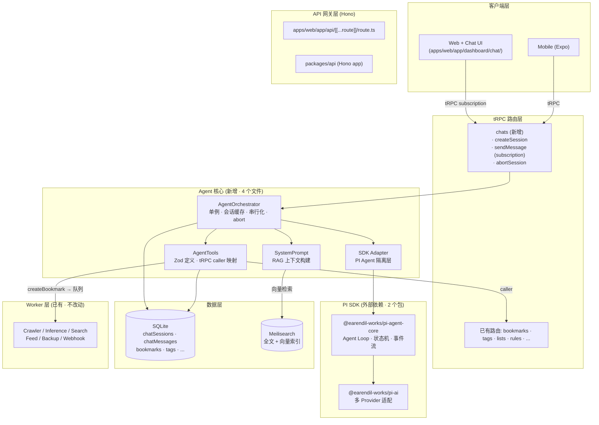
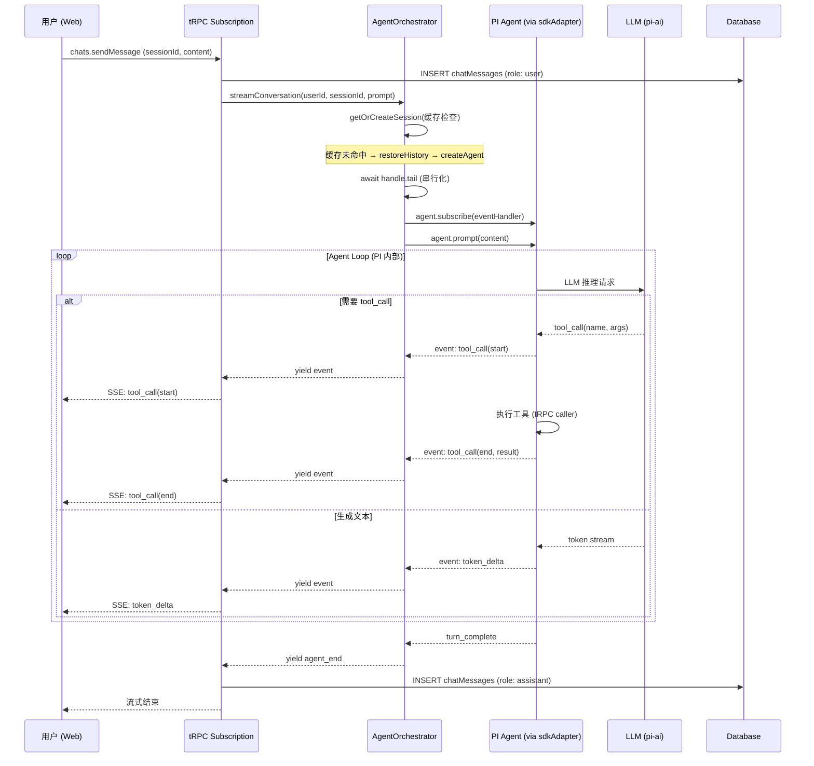
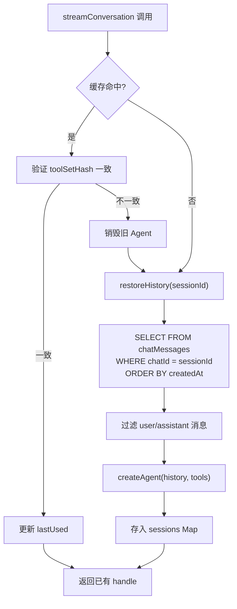

# Karakeep × PI Agent 架构设计文档

> 版本：v2.0
> 日期：2026-08-07
> 状态：待评审
> 关联文档：[ARCHITECTURE.md](./ARCHITECTURE.md)

---

## 修订记录

| 版本 | 日期 | 变更内容 |
|------|------|----------|
| v1.0 | 2026-08-05 | 初稿 |
| v1.1 | 2026-08-05 | 修复 4 项技术缺陷：会话恢复、SSE 认证、凭证桥接、tRPC v11 验证 |
| **v2.0** | **2026-08-07** | **架构优化：① 引入 SDK 隔离层降低依赖风险；② Schema 统一 Zod + 自动转换 TypeBox；③ 凭证桥接简化为 config.ts 优先 + aiSettings 表可选；④ 文件从 20 个精简到 11 个，砍掉 SSE 备用端点与 ChatWorker；⑤ 补充基于代码库实际结构的接口引用** |

---

## 1. 设计目标

引入 PI Agent 框架后，Karakeep 将从"书签管理工具"升级为"AI 驱动的个人知识操作系统"。

本版聚焦：

1. **基于已有代码资产**：`chatSessions` / `chatMessages` 表、`CHAT_ENABLED` / `CHAT_MODEL` 配置、`InferenceClient` 抽象均已在代码库中就绪
2. **降低引入风险**：通过隔离层将 PI SDK 封装在单一文件内，未来可替换
3. **最小化变更面**：11 个新增文件 + 2 个修改文件，不触碰 DB schema 和现有 Worker

---

## 2. 现有 AI 基础设施盘点

以下资产已在代码库中就绪，本方案直接复用，不重复建设。

| 资产 | 位置 | 状态 | 本方案用法 |
|------|------|------|-----------|
| `chatSessions` 表 | `packages/db/schema.ts:653-671` | 已有 | 存储对话会话 |
| `chatMessages` 表 | `packages/db/schema.ts:673-692` | 已有 | 存储消息（角色含 `user` / `assistant` / `toolResult`） |
| `CHAT_ENABLED` 配置 | `packages/shared/config.ts:86` | 已有 | Agent 功能开关 |
| `CHAT_MODEL` 配置 | `packages/shared/config.ts:87` | 已有 | Agent 对话模型 |
| `serverConfig.inference.chatModel` | `packages/shared/config.ts:347` | 已有 | 默认回退到 `INFERENCE_TEXT_MODEL` |
| `InferenceClient` 抽象 | `packages/shared/inference.ts` | 已有 | 自动标签/摘要/OCR 继续使用，不改动 |
| `InferenceClientFactory.build()` | `packages/shared/inference.ts:198-208` | 已有 | 凭证来源（环境变量 → 客户端实例） |
| `searchBookmarks` tRPC procedure | `packages/trpc/routers/bookmarks.ts:933` | 已有 | Agent 工具：搜索书签 |
| `createBookmark` tRPC procedure | `packages/trpc/routers/bookmarks.ts:241` | 已有 | Agent 工具：创建书签 |
| `createCallerFactory` | `packages/trpc/index.ts:92` | 已有 | Agent 工具内部调用 tRPC procedure |
| 向量语义搜索 | `packages/shared/search.ts` + Meilisearch | 已有 | Agent 工具：知识检索 (RAG) |
| tRPC v11 (`@trpc/server: ^11.9.0`) | `packages/trpc/package.json:19` | 已有 | subscription + async generator 流式 |
| Rule Engine | `packages/trpc/lib/ruleEngine.ts` | 已有 | Agent 可触发规则引擎 |

---

## 3. 架构总览

### 3.1 分层架构（Before → After）



### 3.2 设计原则

| 原则 | 实现方式 |
|------|---------|
| **SDK 隔离** | PI SDK 封装在 `sdkAdapter.ts` 一个文件内，其余代码面向 `AgentInterface` 接口编程 |
| **Schema 统一** | 全局 Zod 定义工具参数，仅在 SDK 边界通过 `zodToTypebox()` 转换 |
| **凭证简化** | 优先复用 `config.ts` 环境变量；`aiSettings` 表作为多租户场景的可选扩展 |
| **最小改动** | 不新增 DB 表、不改动现有 Worker、不新增 SSE 端点 |
| **复用已有 procedure** | Agent 工具通过 `createCallerFactory` 内部调用已有 tRPC 路由 |

---

## 4. 核心新增模块

### 4.1 SDK 隔离层（sdkAdapter.ts）

**目的**：将 `pi-agent-core` 和 `pi-ai` 封装在单一文件内，定义接口抽象。如果未来需要替换 SDK，只改此文件。

```typescript
// packages/trpc/lib/agent/sdkAdapter.ts

import { Agent } from "@earendil-works/pi-agent-core";
import { getModel } from "@earendil-works/pi-ai";
import { Type } from "typebox";
import { z } from "zod";
import serverConfig from "@saiye/shared/config";

/**
 * Agent 接口抽象 —— 所有业务代码面向此接口编程。
 * 如果未来替换 PI SDK，只需提供一个新的 implements。
 */
export interface AgentInterface {
  prompt(text: string, opts?: PromptOptions): Promise<void>;
  subscribe(handler: (event: AgentEvent) => void): () => void;
  abort(): void;
  readonly state: { messages: AgentMessage[] };
}

export interface AgentMessage {
  role: "user" | "assistant" | "system";
  content: string;
  stopReason?: string;
  errorMessage?: string;
}

export interface AgentEvent {
  type: "text_delta" | "tool_call" | "tool_result" | "turn_complete" | "error";
  text?: string;
  toolName?: string;
  toolArgs?: unknown;
  toolResult?: unknown;
  errorMessage?: string;
}

export interface PromptOptions {
  images?: Array<{ data: string; mimeType: string }>;
}

export interface CreateAgentParams {
  systemPrompt: string;
  modelPattern?: string;
  history?: Array<{ role: "user" | "assistant"; content: string }>;
  tools: ToolDefinition[];
}

export interface ToolDefinition {
  name: string;
  label: string;
  description: string;
  parameters: Record<string, unknown>; // JSON Schema (由 Zod 转换)
  execute: (args: Record<string, unknown>) => Promise<string>;
}

// ── Zod → TypeBox 转换 ──────────────────────────────

/**
 * 将 Zod schema 转换为 PI SDK 要求的 TypeBox 格式。
 * Zod 4 原生支持 toJSONSchema，再转为 TypeBox 兼容对象。
 */
export function zodToToolSchema(
  name: string,
  description: string,
  zodSchema: z.ZodSchema,
  executor: (args: Record<string, unknown>) => Promise<string>,
): ToolDefinition {
  const jsonSchema = z.toJSONSchema(zodSchema);
  return {
    name,
    label: name,
    description,
    parameters: jsonSchema,
    execute: executor,
  };
}

// ── 工厂函数：唯一接触 PI SDK 的地方 ──────────────────

export function createAgent(params: CreateAgentParams): AgentInterface {
  // 1. 解析模型：优先用 modelPattern，否则回退到 config.ts 的 chatModel
  const pattern =
    params.modelPattern ??
    resolveDefaultPattern();

  const [provider, ...rest] = pattern.split("/");
  const modelId = rest.join("/");
  const model = getModel(provider, modelId);

  // 2. 构建 PI Agent 实例
  const agent = new Agent({
    initialState: {
      systemPrompt: [params.systemPrompt],
      model,
      tools: params.tools.map((t) => ({
        name: t.name,
        description: t.description,
        inputSchema: Type.Object(t.parameters as any),
        execute: async (_id: string, args: any) => {
          const result = await t.execute(args);
          return { content: [{ type: "text", text: result }] };
        },
      })),
      messages: params.history ?? [],
    },
  });

  // 3. 适配为 AgentInterface
  return {
    prompt: (text, opts) =>
      agent.prompt(text, opts as any) as Promise<void>,
    subscribe: (handler) => {
      return agent.subscribe((evt: any) => {
        handler(mapPIEvent(evt));
      });
    },
    abort: () => agent.abort(),
    get state() {
      return { messages: agent.state.messages as AgentMessage[] };
    },
  };
}

function resolveDefaultPattern(): string {
  // 从 config.ts 获取已配置的模型
  if (serverConfig.inference.openAIApiKey) {
    return `openai/${serverConfig.inference.chatModel}`;
  }
  if (serverConfig.inference.ollamaBaseUrl) {
    return `ollama/${serverConfig.inference.textModel}`;
  }
  return "openai/gpt-4o-mini";
}

function mapPIEvent(evt: any): AgentEvent {
  // 将 PI SDK 内部事件映射为统一的 AgentEvent
  // 具体映射规则在实现阶段根据 PI SDK 文档细化
  return evt as AgentEvent;
}
```

**收益**：
- `AgentOrchestrator` 和 `tools.ts` 面向 `AgentInterface` 编程，不直接 import PI SDK
- 替换 SDK 时只改此文件（~100 行），其余代码零改动
- `zodToToolSchema` 让工具定义保持 Zod 风格

---

### 4.2 AgentOrchestrator（会话管理 + 串行化）

**职责**：会话生命周期管理、内存缓存、请求串行化、中断处理。

```typescript
// packages/trpc/lib/agent/orchestrator.ts

import type { AgentInterface, AgentEvent, ToolDefinition } from "./sdkAdapter";
import { createAgent } from "./sdkAdapter";
import { buildSystemPrompt } from "./prompt";

interface SessionHandle {
  agent: AgentInterface;
  userId: string;
  sessionId: string;
  toolSetHash: string;
  modelPattern?: string;
  tail: Promise<void>;
  lastUsed: number;
}

export class AgentOrchestrator {
  private static instance: AgentOrchestrator;
  private sessions = new Map<string, SessionHandle>();
  private readonly MAX_IDLE_MS = 30 * 60 * 1000; // 30 分钟过期

  static getInstance(): AgentOrchestrator {
    if (!AgentOrchestrator.instance) {
      AgentOrchestrator.instance = new AgentOrchestrator();
    }
    return AgentOrchestrator.instance;
  }

  /**
   * 核心执行方法 —— 返回 AsyncGenerator<AgentEvent>
   * 被 tRPC subscription 消费。
   */
  async *streamConversation(params: {
    userId: string;
    sessionId: string;
    prompt: string;
    modelPattern?: string;
    tools: ToolDefinition[];
  }): AsyncGenerator<AgentEvent> {
    const handle = await this.getOrCreateSession(params);

    // ★ 串行化：同一会话的请求必须排队
    await handle.tail;

    // 事件队列 + Promise 桥接
    const queue: AgentEvent[] = [];
    let resolver: (() => void) | null = null;
    const notify = () => { resolver?.(); };

    const unsubscribe = handle.agent.subscribe((evt) => {
      queue.push(evt);
      notify();
    });

    // 触发 Agent 执行（不 await）
    handle.tail = handle.agent.prompt(params.prompt).then(
      () => {
        queue.push({ type: "turn_complete" });
        notify();
      },
      (err: Error) => {
        queue.push({ type: "error", errorMessage: err.message });
        notify();
      },
    );

    // yield 所有事件
    try {
      while (true) {
        if (queue.length === 0) {
          await new Promise<void>((r) => { resolver = r; });
        }
        while (queue.length > 0) {
          const event = queue.shift()!;
          yield event;
          if (event.type === "turn_complete" || event.type === "error") return;
        }
      }
    } finally {
      unsubscribe();
      handle.lastUsed = Date.now();
    }
  }

  /** 中止正在执行的会话 */
  abortSession(userId: string, sessionId: string) {
    const key = `${userId}:${sessionId}`;
    const handle = this.sessions.get(key);
    if (handle) {
      handle.agent.abort();
    }
  }

  /** 清理过期会话（可由定时器调用） */
  cleanupExpired() {
    const now = Date.now();
    for (const [key, handle] of this.sessions) {
      if (now - handle.lastUsed > this.MAX_IDLE_MS) {
        this.sessions.delete(key);
      }
    }
  }

  // ── 内部方法 ──────────────────────────────

  private async getOrCreateSession(params: {
    userId: string;
    sessionId: string;
    tools: ToolDefinition[];
    modelPattern?: string;
  }): Promise<SessionHandle> {
    const key = `${params.userId}:${params.sessionId}`;
    const toolSetHash = params.tools.map((t) => t.name).join(",");

    const existing = this.sessions.get(key);
    if (existing && existing.toolSetHash === toolSetHash) {
      existing.lastUsed = Date.now();
      return existing;
    }

    // ★ 从 DB 恢复历史消息
    const history = await this.restoreHistory(
      params.sessionId,
      params.userId,
    );

    const agent = createAgent({
      systemPrompt: buildSystemPrompt(params.userId),
      modelPattern: params.modelPattern,
      history,
      tools: params.tools,
    });

    const handle: SessionHandle = {
      agent,
      userId: params.userId,
      sessionId: params.sessionId,
      toolSetHash,
      modelPattern: params.modelPattern,
      tail: Promise.resolve(),
      lastUsed: Date.now(),
    };

    this.sessions.set(key, handle);
    return handle;
  }

  private async restoreHistory(
    sessionId: string,
    userId: string,
  ): Promise<Array<{ role: "user" | "assistant"; content: string }>> {
    const { db } = await import("@saiye/db");
    const { chatMessages } = await import("@saiye/db/schema");
    const { eq, and, asc } = await import("drizzle-orm");

    const rows = await db
      .select({ role: chatMessages.role, content: chatMessages.content })
      .from(chatMessages)
      .where(
        and(
          eq(chatMessages.chatId, sessionId),
          // chatMessages 表无 userId 列，通过 chatSessions 关联验证归属
        ),
      )
      .orderBy(asc(chatMessages.createdAt));

    // 仅保留 user / assistant 消息（toolResult 不传给 LLM）
    return rows
      .filter((r) => r.role === "user" || r.role === "assistant")
      .map((r) => ({
        role: r.role as "user" | "assistant",
        content: r.content,
      }));
  }
}
```

---

### 4.3 凭证桥接（简化版）

v2.0 核心变化：**优先复用 `config.ts`，`aiSettings` 表降级为可选扩展**。

```typescript
// packages/trpc/lib/agent/credentials.ts

import serverConfig from "@saiye/shared/config";
import logger from "@saiye/shared/logger";

/**
 * 凭证桥接层（简化版）
 *
 * v2.0 变更：
 * - 默认从 config.ts 环境变量获取凭证（与现有 InferenceClient 一致）
 * - aiSettings 表作为可选扩展，仅在多租户场景启用
 * - 不再向 process.env 注入（避免全局污染）
 */

export class CredentialBridge {
  /**
   * 解析默认模型 pattern（从 config.ts）
   * 返回 "provider/modelId" 格式
   */
  static resolveDefaultPattern(): string {
    if (serverConfig.inference.openAIApiKey) {
      return `openai/${serverConfig.inference.chatModel}`;
    }
    if (serverConfig.inference.ollamaBaseUrl) {
      return `ollama/${serverConfig.inference.textModel}`;
    }
    logger.warn(
      "No AI provider configured. Set OPENAI_API_KEY or OLLAMA_BASE_URL.",
    );
    return "openai/gpt-4o-mini"; // 兜底
  }

  /**
   * 为 pi-ai 配置 Provider 凭证
   * 通过 pi-ai 的运行时配置 API（不污染 process.env）
   */
  static configureProviders(): void {
    // pi-ai 支持通过环境变量配置
    if (serverConfig.inference.openAIApiKey) {
      process.env.OPENAI_API_KEY = serverConfig.inference.openAIApiKey;
    }
    if (serverConfig.inference.openAIBaseUrl) {
      process.env.OPENAI_BASE_URL = serverConfig.inference.openAIBaseUrl;
    }
    if (serverConfig.inference.ollamaBaseUrl) {
      // pi-ai 的 Ollama provider
      process.env.OLLAMA_BASE_URL = serverConfig.inference.ollamaBaseUrl;
    }
  }

  /**
   * ★ 可选：多租户场景下从 aiSettings 表加载用户级配置
   * 当前版本不启用，留作未来扩展。
   */
  // static async initializeForUser(userId: string): Promise<void> { ... }
}
```

**与 v1.x 对比**：
- 不新建 `aiSettings` 表（代码库中不存在此表）
- 不新增 DB migration
- 凭证来源与现有 `InferenceClient` 完全一致：`.env` → `config.ts`

---

### 4.4 工具定义（tools.ts）

所有工具用 Zod 定义参数，通过 `zodToToolSchema` 转换，通过 `createCallerFactory` 调用已有 tRPC procedure。

```typescript
// packages/trpc/lib/agent/tools.ts

import { z } from "zod";
import type { ToolDefinition } from "./sdkAdapter";
import { zodToToolSchema } from "./sdkAdapter";
import { createCallerFactory, type Context } from "../index";
import { appRouter } from "../routers/_app";

// 创建内部 caller —— 用于 Agent 工具调用已有的 tRPC procedure
const createCaller = createCallerFactory(appRouter);

type Caller = ReturnType<typeof createCaller>;

/**
 * 构建 Agent 工具集
 * 每个工具映射到已有的 tRPC procedure，通过 caller 内部调用。
 */
export function buildAgentTools(ctx: Context): ToolDefinition[] {
  const caller = createCaller(ctx);

  return [
    // ── 搜索 ──────────────────────────────
    zodToToolSchema(
      "search_bookmarks",
      "在用户的书签库中搜索。支持全文和语义搜索。用于回答关于已保存内容的问题。",
      z.object({
        query: z.string().describe("搜索关键词或问题"),
        limit: z.number().default(5).describe("返回数量"),
      }),
      async (args) => {
        const result = await caller.bookmarks.searchBookmarks({
          text: args.query,
          sortOrder: "relevance",
        });
        return JSON.stringify(result.bookmarks.slice(0, args.limit));
      },
    ),

    // ── 获取书签详情 ──────────────────────
    zodToToolSchema(
      "get_bookmark_detail",
      "获取书签的完整内容，包括标题、URL、正文、摘要。",
      z.object({ id: z.string().describe("书签 ID") }),
      async (args) => {
        const bookmark = await caller.bookmarks.getBookmark({
          id: args.id,
        });
        return JSON.stringify(bookmark);
      },
    ),

    // ── 创建书签 ──────────────────────────
    zodToToolSchema(
      "create_bookmark",
      "保存一个 URL 作为新书签。会自动触发抓取和 AI 处理。",
      z.object({
        url: z.string().url().describe("要保存的 URL"),
      }),
      async (args) => {
        const result = await caller.bookmarks.createBookmark({
          type: "link",
          url: args.url,
        });
        return JSON.stringify(result);
      },
    ),

    // ── 列出所有标签 ──────────────────────
    zodToToolSchema(
      "list_tags",
      "列出用户的所有标签及其使用次数。用于了解现有标签体系。",
      z.object({
        limit: z.number().default(50),
      }),
      async (args) => {
        const tags = await caller.tags.list({
          nameContains: "",
          sortBy: "usage",
          limit: args.limit,
        });
        return JSON.stringify(tags.tags);
      },
    ),

    // ── 列出所有清单 ──────────────────────
    zodToToolSchema(
      "list_lists",
      "列出用户的所有清单（收藏夹）。用于了解分类体系。",
      z.object({}),
      async () => {
        const lists = await caller.lists.list();
        return JSON.stringify(lists.lists);
      },
    ),

    // ── 添加书签到清单 ────────────────────
    zodToToolSchema(
      "add_to_list",
      "将书签添加到指定清单中。用于自动归类整理。",
      z.object({
        bookmarkId: z.string(),
        listId: z.string(),
      }),
      async (args) => {
        await caller.lists.addToList({
          bookmarkId: args.bookmarkId,
          listId: args.listId,
        });
        return `已将书签 ${args.bookmarkId} 添加到清单 ${args.listId}`;
      },
    ),

    // ── 获取书签标签 ──────────────────────
    zodToToolSchema(
      "get_bookmark_tags",
      "获取书签上已有的标签。",
      z.object({ bookmarkId: z.string() }),
      async (args) => {
        const bookmark = await caller.bookmarks.getBookmark({
          id: args.bookmarkId,
        });
        return JSON.stringify(bookmark.tags);
      },
    ),

    // ── 给书签打标签 ──────────────────────
    zodToToolSchema(
      "attach_tag",
      "给书签添加标签。标签如果不存在会自动创建。",
      z.object({
        bookmarkId: z.string(),
        tagName: z.string().describe("标签名称"),
      }),
      async (args) => {
        await caller.bookmarks.tags.attach({
          bookmarkId: args.bookmarkId,
          tag: args.tagName,
          note: null,
        });
        return `已为书签 ${args.bookmarkId} 添加标签 "${args.tagName}"`;
      },
    ),
  ];
}
```

**设计要点**：
- 工具参数用 Zod 定义，与 tRPC procedure input 风格一致
- 通过 `createCallerFactory(appRouter)(ctx)` 内部调用已有 procedure，零重复代码
- 每个 caller 调用携带 `ctx`，自动继承认证上下文和用户隔离

---

### 4.5 系统提示词 + RAG 上下文（prompt.ts）

```typescript
// packages/trpc/lib/agent/prompt.ts

/**
 * 构建 Agent 系统提示词
 * 定义 Agent 的角色、能力边界和行为规范。
 */
export function buildSystemPrompt(userId: string): string {
  return `你是 Karakeep 的 AI 助手，帮助用户管理他们的书签知识库。

你的能力：
1. **搜索与检索**：用户问"我保存过关于 X 的文章吗？"时，使用 search_bookmarks 工具搜索
2. **知识问答**：基于搜索到的书签内容回答问题，引用来源
3. **自动整理**：批量打标签、归类到清单
4. **智能抓取**：用户说"帮我保存这个链接"时，使用 create_bookmark

行为规范：
- 回答问题前，先用 search_bookmarks 检索相关书签
- 如果搜索结果不足以回答，明确告知用户
- 使用 list_tags 和 list_lists 了解用户现有的分类体系，尽量复用
- 整理操作前说明计划，获得用户确认后批量执行
- 使用中文回复

你可以使用以下工具来操作书签库。工具参数会以 JSON 格式传递。`;
}
```

---

### 4.6 事件协议（types.ts）

```typescript
// packages/trpc/lib/agent/types.ts

/**
 * Agent 事件协议
 * 前端通过 tRPC subscription 消费。
 */
export type AgentEvent =
  | { type: "agent_start" }
  | { type: "agent_end" }
  | { type: "token_delta"; delta: string }
  | {
      type: "tool_call";
      toolName: string;
      status: "start" | "end";
      args?: unknown;
      result?: unknown;
      error?: boolean;
    }
  | { type: "message_complete"; content: string }
  | { type: "error"; message: string };

// 已在 chatMessages 表中预留：
// role: "user" | "assistant" | "toolResult"
// metadata: json 列，可存储 tool_calls 等结构化数据
```

---

### 4.7 tRPC Chat Router

> **实现修正说明**（阶段二落地时发现的 4 处偏差）：
>
> | # | 原设计 | 修正后 | 原因 |
> |---|--------|--------|------|
> | 1 | `sendMessage` input 含 `modelPattern` | 移除该字段 | `streamConversation` 签名不接受，模型由 `CredentialBridge` 统一管理 |
> | 2 | `finally` 中检查 `signal?.aborted` | 改为 `finally` 无条件 abort | tRPC v11 对 AsyncGenerator 通过 `iterator.return()` 触发 `finally`，`signal` 不可靠 |
> | 3 | `getSession` 中 `throw new Error` | 改为 `throw new TRPCError` | 项目统一使用 `TRPCError` 返回结构化错误 |
> | 4 | 未更新 `chatSessions.modifiedAt` | 存储 assistant 消息后 `db.update` 触发 `$onUpdate` | 确保 `listSessions` 排序反映最新活动 |

```typescript
// packages/trpc/routers/chat.ts

import { and, desc, eq } from "drizzle-orm";
import { TRPCError } from "@trpc/server";
import { z } from "zod";

import { db } from "@saiye/db";
import { chatMessages, chatSessions } from "@saiye/db/schema";

import { authedProcedure, router } from "../index";
import { AgentOrchestrator } from "../lib/agent/orchestrator";
import { buildAgentTools } from "../lib/agent/tools";

export const chatAppRouter = router({
  /**
   * 创建会话
   */
  createSession: authedProcedure
    .input(z.object({ title: z.string().optional() }))
    .mutation(async ({ ctx, input }) => {
      const [session] = await db
        .insert(chatSessions)
        .values({
          userId: ctx.user.id,
          title: input.title ?? "新对话",
        })
        .returning();
      return session;
    }),

  /**
   * 列出当前用户的会话
   */
  listSessions: authedProcedure
    .query(async ({ ctx }) => {
      return await db
        .select()
        .from(chatSessions)
        .where(eq(chatSessions.userId, ctx.user.id))
        .orderBy(desc(chatSessions.modifiedAt));
    }),

  /**
   * 获取会话详情（含历史消息）
   */
  getSession: authedProcedure
    .input(z.object({ sessionId: z.string() }))
    .query(async ({ ctx, input }) => {
      const [session] = await db
        .select()
        .from(chatSessions)
        .where(
          and(
            eq(chatSessions.id, input.sessionId),
            eq(chatSessions.userId, ctx.user.id),
          ),
        )
        .limit(1);

      // 【修正 #3】使用 TRPCError 替代 new Error
      if (!session) {
        throw new TRPCError({
          code: "NOT_FOUND",
          message: "Session not found",
        });
      }

      const messages = await db
        .select()
        .from(chatMessages)
        .where(eq(chatMessages.chatId, input.sessionId))
        .orderBy(chatMessages.createdAt);

      return { session, messages };
    }),

  /**
   * 删除会话
   */
  deleteSession: authedProcedure
    .input(z.object({ sessionId: z.string() }))
    .mutation(async ({ ctx, input }) => {
      await db
        .delete(chatMessages)
        .where(eq(chatMessages.chatId, input.sessionId));
      await db
        .delete(chatSessions)
        .where(
          and(
            eq(chatSessions.id, input.sessionId),
            eq(chatSessions.userId, ctx.user.id),
          ),
        );

      AgentOrchestrator.getInstance().abortSession(
        ctx.user.id,
        input.sessionId,
      );

      return { success: true };
    }),

  /**
   * ★ 核心：流式对话（tRPC v11 subscription + async generator）
   *
   * 技术要点：
   * - .subscription() 原生支持 AsyncGenerator
   * - 客户端断连时 tRPC 自动调用 iterator.return()，触发 finally 块
   * - 无需额外 SSE 端点
   */
  sendMessage: authedProcedure
    .input(
      z.object({
        sessionId: z.string(),
        content: z.string().min(1),
        // 【修正 #1】移除 modelPattern —— 模型由 CredentialBridge 统一管理
      }),
    )
    // 【修正 #2】移除 signal 解构 —— 依赖 generator finally 块处理断连
    .subscription(async function* ({ ctx, input }) {
      // 1. 验证会话归属
      const [session] = await db
        .select()
        .from(chatSessions)
        .where(
          and(
            eq(chatSessions.id, input.sessionId),
            eq(chatSessions.userId, ctx.user.id),
          ),
        )
        .limit(1);

      if (!session) {
        yield { type: "error" as const, message: "Session not found" };
        return;
      }

      // 2. 存储 user 消息
      await db.insert(chatMessages).values({
        chatId: input.sessionId,
        role: "user",
        content: input.content,
      });

      // 3. 构建 Agent 工具（携带用户认证上下文）
      const tools = buildAgentTools(ctx);

      // 4. 流式输出 Agent 事件
      let assistantContent = "";
      try {
        for await (const event of AgentOrchestrator.getInstance().streamConversation({
          userId: ctx.user.id,
          sessionId: input.sessionId,
          prompt: input.content,
          // 【修正 #1】不传 modelPattern
          tools,
        })) {
          yield event;

          // 累积 assistant 内容
          if (event.type === "token_delta") {
            assistantContent += event.delta;
          }
        }

        // 5. 存储 assistant 消息
        if (assistantContent) {
          await db.insert(chatMessages).values({
            chatId: input.sessionId,
            role: "assistant",
            content: assistantContent,
          });
        }

        // 6. 【修正 #4】触发 modifiedAt 自动更新（$onUpdate）
        await db
          .update(chatSessions)
          .set({})
          .where(eq(chatSessions.id, input.sessionId));
      } finally {
        // ★ 【修正 #2】客户端断连时 tRPC 调用 iterator.return()，此处自动触发
        AgentOrchestrator.getInstance().abortSession(
          ctx.user.id,
          input.sessionId,
        );
      }
    }),

  /**
   * 中止正在执行的对话
   */
  abortSession: authedProcedure
    .input(z.object({ sessionId: z.string() }))
    .mutation(async ({ ctx, input }) => {
      AgentOrchestrator.getInstance().abortSession(
        ctx.user.id,
        input.sessionId,
      );
      return { success: true };
    }),
});
```

---

### 4.8 注册到 _app.ts

```typescript
// packages/trpc/routers/_app.ts — 修改 1 行

import { chatAppRouter } from "./chat";     // ← 新增

export const appRouter = router({
  // ... 已有路由
  chats: chatAppRouter,                      // ← 新增
});
```

---

## 5. InferenceClient vs pi-ai 边界

### 5.1 双轨并存策略

```
┌─────────────────────────────────────────────────────────┐
│                   Karakeep AI 调用层                      │
│                                                         │
│  ┌───────────────────────────────────────────────────┐  │
│  │  场景 A：自动 AI 处理（保留 InferenceClient）      │  │
│  │  · 自动标签 · 自动摘要 · OCR · 嵌入向量            │  │
│  │  入口：InferenceClient.inferFromText()            │  │
│  │  实现：OpenAI / Ollama（现有，不改动）            │  │
│  │  特点：单轮、无工具、Worker 内同步调用             │  │
│  └───────────────────────────────────────────────────┘  │
│                                                         │
│  ┌───────────────────────────────────────────────────┐  │
│  │  场景 B：Agent 对话（新增 PI SDK）                 │  │
│  │  · 多轮对话 · 工具调用 · 流式输出                  │  │
│  │  入口：AgentOrchestrator.streamConversation()     │  │
│  │  实现：pi-agent-core + pi-ai（通过 sdkAdapter）   │  │
│  │  特点：多轮、工具调度、事件流                      │  │
│  └───────────────────────────────────────────────────┘  │
│                                                         │
│  ★ 凭证来源统一：config.ts 环境变量                     │
│  ★ 未来：InferenceClient 可迁移为 pi-ai 适配器         │
└─────────────────────────────────────────────────────────┘
```

### 5.2 边界规则

| 维度 | InferenceClient（保留） | PI Agent（新增） |
|------|----------------------|-------------------|
| **调用方** | Worker 进程 | tRPC Router (Web 进程) |
| **场景** | 书签自动 AI 处理 | 用户主动对话 |
| **轮次** | 单轮 | 多轮（Agent Loop） |
| **工具** | 无 | 有（AgentTool） |
| **流式** | Worker 内部消费 | 对外暴露 (subscription) |
| **持久化** | 无状态 | 有状态 (chatMessages 表) |
| **凭证** | config.ts 环境变量 | 同上（通过 CredentialBridge） |

---

## 6. 端到端数据流

### 6.1 对话请求流程



### 6.2 会话恢复流程



### 6.3 中断处理流程

```
用户关闭页面 / 点击"停止"
    │
    ▼
tRPC subscription 检测到断连
    │
    ├── opts.signal.aborted = true
    │
    ▼
sendMessage finally 块执行
    │
    ├── AgentOrchestrator.abortSession(userId, sessionId)
    │   ├── handle.agent.abort()
    │   └── PI Agent 内部中止 LLM 请求
    │
    ▼
事件流自然结束，generator return
```

---

## 7. 变更影响矩阵

### 7.1 新增文件（11 个）

| # | 文件路径 | 类型 | 描述 | 复杂度 |
|---|----------|------|------|--------|
| 1 | `packages/trpc/lib/agent/sdkAdapter.ts` | Service | PI SDK 隔离层 + Zod→TypeBox 转换 | 高 |
| 2 | `packages/trpc/lib/agent/orchestrator.ts` | Service | Agent 编排（单例 + 缓存 + 串行化 + abort） | 高 |
| 3 | `packages/trpc/lib/agent/credentials.ts` | Service | 凭证桥接（简化版，复用 config.ts） | 低 |
| 4 | `packages/trpc/lib/agent/tools.ts` | Tools | 工具定义（Zod + tRPC caller 映射） | 中 |
| 5 | `packages/trpc/lib/agent/prompt.ts` | Service | 系统提示词 + RAG 上下文构建 | 低 |
| 6 | `packages/trpc/lib/agent/types.ts` | Types | AgentEvent + 接口类型 | 低 |
| 7 | `packages/trpc/routers/chat.ts` | Router | tRPC chat 路由（CRUD + sendMessage subscription） | 中 |
| 8 | `apps/web/app/dashboard/chat/page.tsx` | Page | Chat 页面 | 高 |
| 9 | `apps/web/components/chat/ChatMessage.tsx` | React | 消息气泡（含 tool 调用可视化） | 中 |
| 10 | `apps/web/components/chat/ChatInput.tsx` | React | 输入框 + 发送/停止 | 低 |
| 11 | `packages/trpc/lib/agent/__tests__/agent.test.ts` | Test | 核心逻辑测试 | 中 |

### 7.2 修改文件（2 个）

| # | 文件路径 | 改动 | 影响 |
|---|----------|------|------|
| 1 | `packages/trpc/routers/_app.ts` | 注册 `chatAppRouter` | 新增 2 行 |
| 2 | `packages/trpc/package.json` | 添加 pi-agent-core / pi-ai / typebox 依赖 | 新增 3 行 |

### 7.3 确认零改动

| 文件 | 说明 |
|------|------|
| `packages/db/schema.ts` | `chatSessions` / `chatMessages` 已就绪 |
| `packages/shared/inference.ts` | `InferenceClient` 保持不变 |
| `packages/shared/config.ts` | `CHAT_ENABLED` / `CHAT_MODEL` 已就绪 |
| `apps/workers/**` | 无需 ChatWorker，重操作走已有队列 |

### 7.4 依赖变更

```jsonc
// packages/trpc/package.json — 新增依赖
{
  "dependencies": {
    "@earendil-works/pi-agent-core": "^17.0.0",
    "@earendil-works/pi-ai": "^17.0.0",
    "typebox": "^0.33.0"
  }
}
```

---

## 8. 前端设计

### 8.1 tRPC 客户端配置

前端需要配置 `httpSubscriptionLink` 以支持 subscription 流式传输。

```typescript
// apps/web/lib/trpc.ts — 配置更新

import { httpBatchLink, httpSubscriptionLink, splitLink } from "@trpc/client";

export const trpcClient = trpc.createClient({
  links: [
    splitLink({
      // subscription 请求走 subscription link
      condition: (op) => op.type === "subscription",
      true: httpSubscriptionLink({ url: "/api/trpc" }),
      // 其余请求走 batch link
      false: httpBatchLink({ url: "/api/trpc" }),
    }),
  ],
});
```

### 8.2 Chat 页面交互

```typescript
// apps/web/app/dashboard/chat/page.tsx — 核心交互逻辑示意

function ChatPage() {
  const [messages, setMessages] = useState<ChatMessage[]>([]);
  const [streaming, setStreaming] = useState(false);

  // 会话管理
  const [sessions] = trpc.chats.listSessions.useSuspenseQuery();
  const [currentSessionId, setCurrentSessionId] = useState<string>();

  // ★ 流式订阅
  trpc.chats.sendMessage.useSubscription(
    { sessionId: currentSessionId!, content: inputValue },
    {
      enabled: streaming,
      onData(event) {
        switch (event.type) {
          case "token_delta":
            // 追加到最后一条 assistant 消息
            setMessages(prev => appendDelta(prev, event.delta));
            break;
          case "tool_call":
            // 显示工具调用状态
            setMessages(prev => appendToolCall(prev, event));
            break;
          case "message_complete":
            setMessages(prev => finalizeLast(prev, event.content));
            break;
          case "agent_end":
            setStreaming(false);
            break;
          case "error":
            showError(event.message);
            setStreaming(false);
            break;
        }
      },
    },
  );
}
```

### 8.3 tRPC 路由结构

新增路由需要在 Next.js 的 dashboard 布局中加入入口。

```
apps/web/app/dashboard/
├── layout.tsx          # 已有 — 新增 Chat 导航链接
└── chat/
    └── page.tsx        # 新增 — Chat 主页面
```

---

## 9. 技术决策记录

| # | 决策 | 理由 | v2.0 变化 |
|---|------|------|-----------|
| 1 | SDK 选择：pi-agent-core + pi-ai | 成熟的 Agent Loop、状态机、事件流 | 保留，新增隔离层降低风险 |
| 2 | SDK 隔离层 (`sdkAdapter.ts`) | 将 PI SDK 封装在单文件，可替换 | **新增** |
| 3 | Schema：Zod 定义 + 自动转换 TypeBox | 全局 Zod 一致性，仅在 SDK 边界转换 | **优化**（v1.x 用纯 TypeBox） |
| 4 | 凭证：复用 config.ts，不建 aiSettings 表 | 与现有 InferenceClient 一致，减少复杂度 | **优化**（v1.x 新建表 + Bridge） |
| 5 | 流式：tRPC subscription（不新增 SSE） | v11 原生支持，signal 自动处理断连 | **优化**（v1.x 有 SSE 备用端点） |
| 6 | 不新增 ChatWorker | 同步对话在 Web 进程内完成，重操作走已有队列 | **优化**（v1.x 新增 chatWorker.ts） |
| 7 | 串行化：tail Promise 链 | 同会话多请求必须串行 | 保留 |
| 8 | 会话恢复：DB 重建 | 保证长对话上下文连续性 | 保留 |
| 9 | 工具通过 tRPC caller 映射 | 零重复代码，复用已有 procedure 和认证 | **新增** |

---

## 10. 风险与缓解

| # | 风险 | 概率 | 影响 | 缓解措施 |
|---|------|------|------|----------|
| 1 | pi-agent-core API 不稳定 | 中 | 高 | **sdkAdapter.ts 隔离层**：仅此文件接触 SDK，替换成本可控 |
| 2 | TypeBox 转换精度丢失 | 低 | 中 | `zodToToolSchema` 做转换 + 单元测试覆盖常见类型 |
| 3 | tRPC subscription 代理缓冲 | 低 | 中 | 前端配置 `httpSubscriptionLink`，生产环境需验证 Nginx/CDN 兼容性 |
| 4 | SessionHandle 内存泄漏 | 低 | 中 | 30 分钟过期 + `cleanupExpired()` 定时清理 |
| 5 | 同会话并发请求 | 低 | 高 | tail Promise 链强制串行 |
| 6 | LLM 不调用工具 | 中 | 低 | 清晰的 tool description + 系统提示词引导 |
| 7 | Token 成本超预期 | 中 | 中 | 限制历史消息轮数（如最近 10 轮）+ 未来加配额 |
| 8 | chatMessages 无 userId 列 | 确定 | 低 | 通过 chatSessions.userId 关联验证归属 |

---

## 11. 里程碑

### 阶段一：Agent 核心（第 1 周）

| 任务 | 交付物 | 验证方式 |
|------|--------|---------|
| 添加 pi-agent-core / pi-ai 依赖 | `package.json` 更新 | `pnpm install` 成功 |
| 实现 `sdkAdapter.ts` | AgentInterface + createAgent | 单元测试：创建 Agent 实例 |
| 实现 `orchestrator.ts` | 单例 + 缓存 + 串行化 | 单元测试：并发请求串行化 |
| 实现 `credentials.ts` | CredentialBridge | config.ts 凭证可正确解析 |

### 阶段二：工具与路由（第 2 周）

| 任务 | 交付物 | 验证方式 |
|------|--------|---------|
| 实现 `tools.ts` | 8 个 Agent 工具 | 集成测试：工具可调用 tRPC procedure |
| 实现 `chat.ts` 路由 | CRUD + sendMessage | E2E 测试：创建会话 → 发送消息 → 收到事件流 |
| 注册到 `_app.ts` | appRouter 更新 | tRPC 类型推导正确 |

### 阶段三：前端 UI（第 3 周）

| 任务 | 交付物 | 验证方式 |
|------|--------|---------|
| tRPC 客户端 subscription 配置 | httpSubscriptionLink | 手动验证流式连接 |
| Chat 页面 + 消息组件 | 完整 UI | 手动验证：发消息、流式显示、工具调用展示 |
| 会话列表 + 切换 | 侧边栏 | 手动验证 |

### 阶段四：打磨与测试（第 4 周）

| 任务 | 交付物 | 验证方式 |
|------|--------|---------|
| 中断/停止功能 | abort 按钮 | 手动验证：停止后 Agent 立即中止 |
| 会话恢复 | 历史消息加载 | 手动验证：刷新页面后上下文连续 |
| 上下文窗口管理 | 历史消息截断策略 | 测试：长对话不超 token 限制 |
| 过期会话清理 | cleanupExpired | 测试：30 分钟后缓存自动清理 |

---

## 附录 A：新增 API 端点

| 方法 | 路径 | 描述 |
|------|------|------|
| MUTATION (tRPC) | `chats.createSession` | 创建会话 |
| QUERY (tRPC) | `chats.listSessions` | 列出会话 |
| QUERY (tRPC) | `chats.getSession` | 获取会话详情（含消息） |
| MUTATION (tRPC) | `chats.deleteSession` | 删除会话 |
| **SUBSCRIPTION (tRPC)** | **`chats.sendMessage`** | **流式对话（核心）** |
| MUTATION (tRPC) | `chats.abortSession` | 中止对话 |

## 附录 B：AgentEvent 协议

```typescript
type AgentEvent =
  | { type: "agent_start" }
  | { type: "token_delta"; delta: string }
  | { type: "tool_call"; toolName: string; status: "start" | "end"; args?; result?; error? }
  | { type: "message_complete"; content: string }
  | { type: "agent_end" }
  | { type: "error"; message: string };
```

## 附录 C：Agent 工具清单

| 工具名 | 映射的 tRPC procedure | 描述 |
|--------|----------------------|------|
| `search_bookmarks` | `bookmarks.searchBookmarks` | 全文 + 语义搜索 |
| `get_bookmark_detail` | `bookmarks.getBookmark` | 获取书签全文 |
| `create_bookmark` | `bookmarks.createBookmark` | 保存 URL（触发抓取） |
| `list_tags` | `tags.list` | 列出标签 |
| `list_lists` | `lists.list` | 列出清单 |
| `add_to_list` | `lists.addToList` | 归类到清单 |
| `get_bookmark_tags` | `bookmarks.getBookmark` | 获取书签标签 |
| `attach_tag` | `bookmarks.tags.attach` | 打标签 |

## 附录 D：环境变量配置

```bash
# .env — 已有，无需新增
CHAT_ENABLED=true                    # 开启 Chat 功能
CHAT_MODEL=gpt-4o-mini              # Chat 模型（可选，默认回退到 INFERENCE_TEXT_MODEL）
OPENAI_API_KEY=sk-xxx               # 已有
# OLLAMA_BASE_URL=http://localhost:11434  # 已有（Ollama 用户）
```
